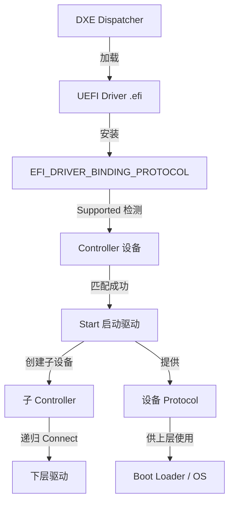
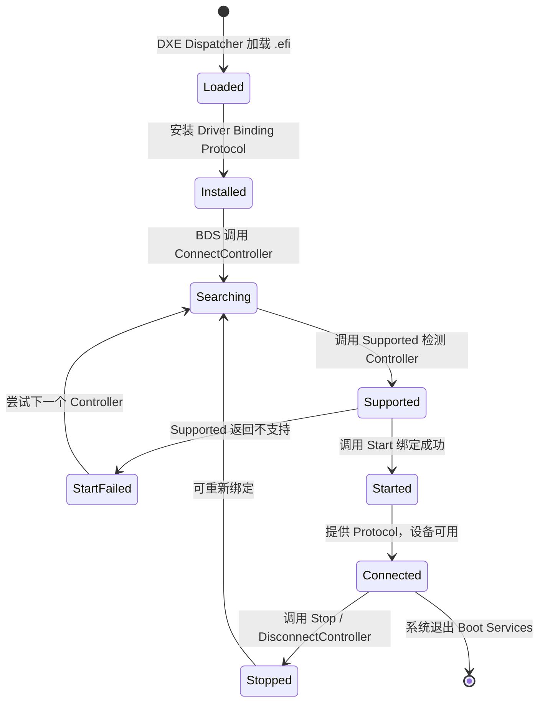

# UEFI驱动模型基础

## 前言

**C：** 这篇文章带你搞清楚 UEFI 驱动模型的核心机制——驱动是怎么被发现、加载、绑定到设备的，以及生命周期是怎样的。如果你打算写自己的 UEFI 驱动，这些是你必须先理解的基础。

<!-- more -->

## UEFI Driver Model 概览

UEFI 的驱动模型和传统操作系统的驱动模型有很大不同。在 UEFI 中，驱动以 Protocol 的形式存在，系统通过 **Connect/Disconnect** 机制来管理驱动和控制器（Controller）之间的关系。

一个 UEFI 驱动本质上是一个 DXE 模块（`.efi` 文件），它会在启动阶段被加载到内存中执行。驱动的主要工作就是：**发现设备 → 绑定设备 → 提供服务**。



::: tip 核心思想
UEFI 驱动模型的核心思想是"协议驱动"——一切皆 Protocol，驱动通过安装和发现 Protocol 来协同工作。
:::

## EFI_DRIVER_BINDING_PROTOCOL

这是 UEFI 驱动模型中 **最核心** 的协议。每个 UEFI 驱动都必须安装这个协议，系统才能发现和管理它。

### 协议定义

```c
#define EFI_DRIVER_BINDING_PROTOCOL_GUID \
  { 0x18A031AB, 0xB443, 0x4D1A, \
    { 0xA5, 0xC0, 0x0C, 0x09, 0x26, 0x1E, 0x9F, 0x71 } }

typedef struct _EFI_DRIVER_BINDING_PROTOCOL {
  EFI_DRIVER_BINDING_SUPPORTED  Supported;
  EFI_DRIVER_BINDING_START      Start;
  EFI_DRIVER_BINDING_STOP       Stop;
  UINT32                        Version;
  EFI_IMAGE_HANDLE              ImageHandle;
  EFI_HANDLE                    DriverBindingHandle;
} EFI_DRIVER_BINDING_PROTOCOL;
```

### 三个核心函数

| 函数 | 作用 | 返回值 |
|------|------|--------|
| `Supported()` | 检测驱动是否支持给定的 Controller | `EFI_SUCCESS` = 支持 |
| `Start()` | 将驱动绑定到 Controller，启动设备 | `EFI_SUCCESS` = 启动成功 |
| `Stop()` | 解除驱动与 Controller 的绑定 | `EFI_SUCCESS` = 停止成功 |

### Supported 函数

`Supported` 是驱动的"门卫"，它负责判断自己能不能管理某个 Controller。通常通过检测 Controller 上是否已安装特定的 Protocol 来判断。

```c
EFI_STATUS
EFIAPI
MyDriverSupported (
  IN EFI_DRIVER_BINDING_PROTOCOL  *This,
  IN EFI_HANDLE                   ControllerHandle,
  IN EFI_DEVICE_PATH_PROTOCOL     *RemainingDevicePath
  )
{
  EFI_STATUS  Status;
  // 检测 Controller 是否有 PCI I/O Protocol
  EFI_PCI_IO_PROTOCOL *PciIo;

  Status = gBS->OpenProtocol (
                  ControllerHandle,
                  &gEfiPciIoProtocolGuid,
                  (VOID **)&PciIo,
                  This->DriverBindingHandle,
                  ControllerHandle,
                  EFI_OPEN_PROTOCOL_TEST_PROTOCOL
                  );
  return Status;
}
```

::: warning 注意
`Supported` 中必须使用 `EFI_OPEN_PROTOCOL_TEST_PROTOCOL` 属性打开协议，不要真正获取协议接口，避免影响驱动计数。
:::

### Start 函数

当 `Supported` 返回成功，系统会调用 `Start` 来真正启动驱动。

```c
EFI_STATUS
EFIAPI
MyDriverStart (
  IN EFI_DRIVER_BINDING_PROTOCOL  *This,
  IN EFI_HANDLE                   ControllerHandle,
  IN EFI_DEVICE_PATH_PROTOCOL     *RemainingDevicePath
  )
{
  EFI_STATUS           Status;
  EFI_PCI_IO_PROTOCOL  *PciIo;

  // 真正打开 PCI I/O Protocol
  Status = gBS->OpenProtocol (
                  ControllerHandle,
                  &gEfiPciIoProtocolGuid,
                  (VOID **)&PciIo,
                  This->DriverBindingHandle,
                  ControllerHandle,
                  EFI_OPEN_PROTOCOL_BY_DRIVER
                  );
  if (EFI_ERROR(Status)) {
    return Status;
  }

  // 初始化硬件、分配资源...
  // 在 Controller 上安装设备特定 Protocol
  Status = gBS->InstallProtocolInterface (
                  &ControllerHandle,
                  &gEfiMyDeviceProtocolGuid,
                  EFI_NATIVE_INTERFACE,
                  &MyDeviceProtocol
                  );

  return Status;
}
```

### Stop 函数

```c
EFI_STATUS
EFIAPI
MyDriverStop (
  IN  EFI_DRIVER_BINDING_PROTOCOL  *This,
  IN  EFI_HANDLE                   ControllerHandle,
  IN  UINTN                        NumberOfChildren,
  IN  EFI_HANDLE                   *ChildHandleBuffer
  )
{
  // 1. 卸载子设备上的 Protocol
  // 2. 释放资源
  // 3. 关闭打开的 Protocol
  gBS->CloseProtocol (
         ControllerHandle,
         &gEfiPciIoProtocolGuid,
         This->DriverBindingHandle,
         ControllerHandle
         );
  return EFI_SUCCESS;
}
```

## 驱动类型：Bus Driver vs Device Driver

UEFI 驱动分为两大类，它们的职责不同：

| 特性 | Bus Driver | Device Driver |
|------|-----------|---------------|
| 职责 | 枚举子设备、创建子 Controller | 管理单个设备、提供功能 |
| 例子 | PCI Bus Driver、USB Hub Driver | 网卡驱动、显卡驱动 |
| 子设备 | 会产生（枚举出来的子 Controller） | 不会产生子设备 |
| `Stop` 处理 | 需要先停止所有子设备的驱动 | 直接停止即可 |

::: details Bus Driver 的工作流程
Bus Driver 的 `Start` 函数在初始化硬件后，会枚举总线上的子设备。对于每个发现的子设备，Bus Driver 会：
1. 创建新的 EFI_HANDLE
2. 在新 Handle 上安装 Device Path Protocol
3. 在新 Handle 上安装总线特定的 Protocol（如 PCI I/O）
4. 调用 `gBS->ConnectController()` 让系统为子设备匹配驱动
:::

## 驱动辅助协议

除了核心的 Driver Binding Protocol，UEFI 规范还定义了几个辅助协议：

### Component Name Protocol

提供驱动的人类可读名称，方便调试和管理：

```c
#define EFI_COMPONENT_NAME_PROTOCOL_GUID \
  { 0x107A772C, 0xD5E1, 0x11D4, \
    { 0x9A, 0x46, 0x00, 0x90, 0x27, 0x3F, 0xC1, 0x4D } }

typedef struct _EFI_COMPONENT_NAME_PROTOCOL {
  EFI_COMPONENT_NAME_GET_DRIVER_NAME      GetDriverName;
  EFI_COMPONENT_NAME_GET_CONTROLLER_NAME   GetControllerName;
  CHAR8                                   *SupportedLanguages;
} EFI_COMPONENT_NAME_PROTOCOL;
```

### Driver Diagnostics Protocol

提供驱动自检功能：

```c
typedef struct _EFI_DRIVER_DIAGNOSTICS_PROTOCOL {
  EFI_DRIVER_DIAGNOSTICS_RUN_DIAGNOSTICS  RunDiagnostics;
  CHAR8                                   *SupportedLanguages;
  // ...
} EFI_DRIVER_DIAGNOSTICS_PROTOCOL;
```

### Driver Configuration Protocol

允许用户或固件配置驱动参数。

## 驱动生命周期状态图

下面的状态图展示了 UEFI 驱动从加载到卸载的完整生命周期：



## 驱动与 Controller 的关系

在 UEFI 中，**Controller** 是一个抽象概念——它可以是一块物理硬件、一个虚拟设备，甚至是一个软件模块。驱动通过 `OpenProtocol` 来"认领"Controller：

```c
// OpenProtocol 的属性决定了驱动的访问权限
typedef enum {
  EFI_OPEN_PROTOCOL_TEST_PROTOCOL,  // 仅测试，不计数
  EFI_OPEN_PROTOCOL_GET_PROTOCOL,   // 获取接口，不计数
  EFI_OPEN_PROTOCOL_BY_DRIVER,      // 驱动独占，计数+1
  EFI_OPEN_PROTOCOL_BY_CHILD_CONTROLLER, // 子控制器使用
  // ...
} EFI_OPEN_PROTOCOL_TYPE;
```

::: tip 理解 OpenProtocol
`BY_DRIVER` 属性非常重要——它意味着"我要独占管理这个 Controller"。如果另一个驱动已经用 `BY_DRIVER` 打开了同一个 Protocol，新的驱动就会被拒绝。这保证了同一时刻只有一个驱动管理一个设备。
:::

## 完整的驱动入口模板

```c
#include <Uefi.h>
#include <Library/UefiLib.h>
#include <Library/UefiBootServicesTableLib.h>
#include <Protocol/DriverBinding.h>
#include <Protocol/ComponentName.h>

STATIC EFI_DRIVER_BINDING_PROTOCOL gMyDriverBinding = {
  MyDriverSupported,
  MyDriverStart,
  MyDriverStop,
  0x10,            // Version
  NULL,            // ImageHandle（在入口函数中设置）
  NULL             // DriverBindingHandle
};

STATIC EFI_COMPONENT_NAME_PROTOCOL gMyDriverComponentName = {
  MyDriverGetDriverName,
  MyDriverGetControllerName,
  "en"
};

EFI_STATUS
EFIAPI
MyDriverEntryPoint (
  IN EFI_HANDLE        ImageHandle,
  IN EFI_SYSTEM_TABLE  *SystemTable
  )
{
  EFI_STATUS Status;

  // 安装 Driver Binding Protocol
  gMyDriverBinding.ImageHandle = ImageHandle;
  Status = gBS->InstallMultipleProtocolInterfaces (
                  &gMyDriverBinding.DriverBindingHandle,
                  &gEfiDriverBindingProtocolGuid, &gMyDriverBinding,
                  &gEfiComponentNameProtocolGuid, &gMyDriverComponentName,
                  NULL
                  );
  return Status;
}
```

## 小结

这篇文章介绍了 UEFI 驱动模型的核心概念：

- **EFI_DRIVER_BINDING_PROTOCOL** 是驱动的灵魂，它的 `Supported/Start/Stop` 三剑客管理着驱动与设备的绑定关系
- **Bus Driver** 负责枚举子设备，**Device Driver** 负责管理具体设备
- 驱动的生命周期是：**加载 → 安装协议 → 搜索 → 绑定 → 运行 → 停止**
- **Component Name** 和 **Driver Diagnostics** 等辅助协议让驱动更完善

理解这些基础后，你就可以进入具体的总线驱动开发了。下一篇文章我们会实战写一个 PCI 驱动。
