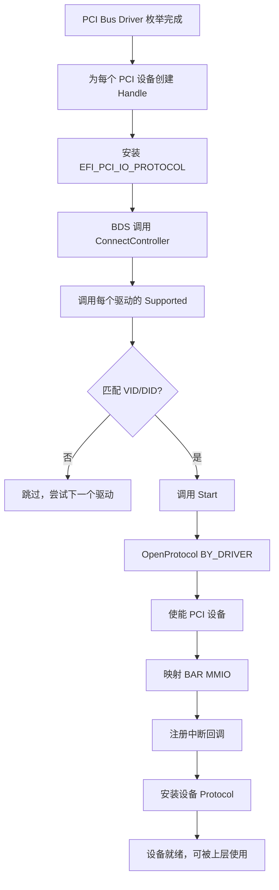

# PCI驱动开发入门

## 前言

**C：** 这篇文章带你从零写一个 UEFI PCI 驱动，你会学到怎么枚举 PCI 设备、访问配置空间、映射 BAR 内存、处理中断。PCI 是 x86 平台最基础的总线，掌握了它，其他总线的驱动你也能举一反三。

<!-- more -->

## PCI 枚举基础

在 UEFI 中，PCI 总线的枚举工作由 **PCI Bus Driver**（`PciBusDxe`）自动完成。它会扫描所有 PCI 拓扑，为每个 PCI 设备创建 Controller Handle，并安装 `EFI_PCI_IO_PROTOCOL`。

你不需要自己去做总线枚举——你只需要写一个 Device Driver，通过 `EFI_DRIVER_BINDING_PROTOCOL` 来匹配并管理目标设备。

### PCI 配置空间

每个 PCI 设备都有一个 256 字节（PCIe 扩展到 4096 字节）的配置空间：

| 偏移 | 大小 | 字段 | 说明 |
|------|------|------|------|
| 0x00 | 2B | Vendor ID | 厂商 ID，0xFFFF 表示无效设备 |
| 0x02 | 2B | Device ID | 设备 ID |
| 0x08 | 1B | Revision ID | 修订版本 |
| 0x09 | 1B | Class Code | 设备类别（3 字节：基类/子类/编程接口） |
| 0x0A | 1B | Subclass | 子类代码 |
| 0x0E | 1B | Header Type | 头类型：0=标准，1=PCI桥 |
| 0x10 | 16B | BAR | Base Address Register（最多 6 个） |
| 0x3C | 1B | Interrupt Line | 中断线号 |

## EFI_PCI_IO_PROTOCOL

这是 PCI 驱动开发中 **最常用** 的协议，它封装了所有 PCI 设备的 I/O 操作。

### 协议核心接口

```c
typedef struct _EFI_PCI_IO_PROTOCOL {
  // ---- 配置空间访问 ----
  EFI_PCI_IO_CONFIG_READ       Pci.Read;
  EFI_PCI_IO_CONFIG_WRITE      Pci.Write;
  // ---- 内存空间访问 ----
  EFI_PCI_IO_MEM_READ          Mem.Read;
  EFI_PCI_IO_MEM_WRITE         Mem.Write;
  // ---- I/O 空间访问 ----
  EFI_PCI_IO_IO_READ           Io.Read;
  EFI_PCI_IO_IO_WRITE          Io.Write;
  // ---- 其他 ----
  EFI_PCI_IO_COPY_MEM          CopyMem;
  EFI_PCI_IO_MAP               Map;
  EFI_PCI_IO_UNMAP             Unmap;
  EFI_PCI_IO_ALLOCATE_BUFFER   AllocateBuffer;
  EFI_PCI_IO_FREE_BUFFER       FreeBuffer;
  EFI_PCI_IO_FLUSH             Flush;
  // ---- 属性 ----
  EFI_PCI_IO_GET_ATTRIBUTES    GetAttributes;
  EFI_PCI_IO_SET_ATTRIBUTES    SetAttributes;
  // ---- 中断 ----
  EFI_PCI_IO_CONFIGURE         Configure;       // Legacy 中断
  EFI_PCI_IO_INTERRUPT         RegisterForInterrupts;  // 注册中断
};
```

### 读取 PCI 配置空间

```c
EFI_STATUS
ReadPciConfig (
  IN EFI_PCI_IO_PROTOCOL *PciIo
  )
{
  EFI_STATUS        Status;
  PCI_TYPE00        PciData;
  UINT8             SubClass;

  // 一次性读取整个 256 字节标准配置空间
  Status = PciIo->Pci.Read (
                        PciIo,
                        EfiPciIoWidthUint8,   // 按字节读取
                        0,                    // 从偏移 0 开始
                        sizeof(PCI_TYPE00),   // 读取长度
                        &PciData
                        );
  if (EFI_ERROR(Status)) {
    return Status;
  }

  DEBUG((DEBUG_INFO, "Vendor ID:  0x%04X\n", PciData.Hdr.VendorId));
  DEBUG((DEBUG_INFO, "Device ID:  0x%04X\n", PciData.Hdr.DeviceId));
  DEBUG((DEBUG_INFO, "Class Code: 0x%06X\n",
         (PciData.Hdr.ClassCode[2] << 16) |
         (PciData.Hdr.ClassCode[1] << 8)  |
         PciData.Hdr.ClassCode[0]));

  return EFI_SUCCESS;
}
```

## BAR 映射

PCI 设备的 BAR（Base Address Register）定义了设备在内存或 I/O 空间中的地址范围。访问设备寄存器前，你需要先映射 BAR。

```c
EFI_STATUS
MapPciBar (
  IN  EFI_PCI_IO_PROTOCOL  *PciIo,
  IN  UINT8                BarIndex,
  OUT VOID                 **MappedAddress,
  OUT UINT64               *BarSize
  )
{
  EFI_STATUS  Status;

  // 获取 BAR 的物理地址和大小
  Status = PciIo->GetBarAttributes (
                    PciIo,
                    BarIndex,
                    NULL,
                    NULL    // ResDescList
                    );
  if (EFI_ERROR(Status)) {
    return Status;
  }

  // 映射 BAR 到 CPU 可访问的虚拟地址
  Status = PciIo->Map (
                    PciIo,
                    EfiPciIoOperationBusMasterCommonBuffer,
                    NULL,   // 由 BAR 自动决定
                    BarSize,
                    MappedAddress,
                    NULL    // Mapping
                    );

  return Status;
}
```

::: warning BAR 映射注意事项
1. `Map()` 返回的地址是 CPU 地址空间中的虚拟地址，直接用指针访问即可
2. 映射后的内存对齐和 cache 属性由 PCI Bus Driver 自动处理
3. 使用完 `Map()` 后要记得调用 `Unmap()` 释放映射
:::

## 中断处理

UEFI 中 PCI 中断有两种主要方式：

### Legacy 中断 vs MSI

| 特性 | Legacy 中断 (INTx) | MSI (Message Signaled Interrupts) |
|------|-------------------|----------------------------------|
| 信号方式 | 硬件中断线 (IRQ) | 内存写操作 |
| 支持数量 | 每设备 1-4 个 | 最多 2048 个 |
| 共享 | 支持 | 不支持 |
| 配置复杂度 | 需要路由配置 | 较简单 |
| UEFI 支持 | EFI_PCI_IO 配置 | 通过 PCI 配置空间 |

### 注册中断回调

```c
// 中断回调函数
VOID
EFIAPI
MyPciInterruptHandler (
  IN VOID  *Context
  )
{
  MY_DEVICE_CONTEXT *DevCtx = (MY_DEVICE_CONTEXT *)Context;

  // 读取设备中断状态寄存器，确认是否是我们的中断
  UINT32 Status;
  DevCtx->PciIo->Mem.Read (
                       DevCtx->PciIo,
                       EfiPciIoWidthUint32,
                       0,              // BAR 索引
                       INT_STATUS_REG_OFFSET,
                       1,
                       &Status
                       );

  if (Status & INT_PENDING_BIT) {
    // 清除中断状态
    Status |= INT_CLEAR_BIT;
    DevCtx->PciIo->Mem.Write (
                         DevCtx->PciIo,
                         EfiPciIoWidthUint32,
                         0,
                         INT_STATUS_REG_OFFSET,
                         1,
                         &Status
                         );
    // 处理中断逻辑...
  }
}

// 注册中断
EFI_STATUS
RegisterInterrupt (
  IN MY_DEVICE_CONTEXT *DevCtx
  )
{
  EFI_STATUS Status;
  EFI_HANDLE  InterruptHandle = NULL;

  // 使用 EFI_PCI_IO_PROTOCOL 注册中断
  Status = DevCtx->PciIo->RegisterForInterrupts (
                            DevCtx->PciIo,
                            MyPciInterruptHandler,
                            DevCtx     // Context 传给回调
                            );
  return Status;
}
```

## 完整的 PCI 驱动示例

下面是一个最小但完整的 PCI 驱动模板：

```c
#include <Uefi.h>
#include <Library/UefiLib.h>
#include <Library/UefiBootServicesTableLib.h>
#include <Library/MemoryAllocationLib.h>
#include <Library/DebugLib.h>
#include <Protocol/DriverBinding.h>
#include <Protocol/PciIo.h>

// 目标设备的 Vendor ID 和 Device ID
#define MY_VENDOR_ID   0x8086  // Intel
#define MY_DEVICE_ID   0x1502  // 示例网卡

typedef struct {
  EFI_PCI_IO_PROTOCOL    *PciIo;
  VOID                   *MmioBase;
  UINT64                 MmioSize;
} MY_DEVICE_CONTEXT;

// ---- Supported ----
EFI_STATUS
EFIAPI
MyPciDriverSupported (
  IN EFI_DRIVER_BINDING_PROTOCOL  *This,
  IN EFI_HANDLE                   Controller,
  IN EFI_DEVICE_PATH_PROTOCOL     *RemainingPath
  )
{
  EFI_STATUS           Status;
  EFI_PCI_IO_PROTOCOL  *PciIo;
  PCI_TYPE00           Pci;

  Status = gBS->OpenProtocol (
                  Controller,
                  &gEfiPciIoProtocolGuid,
                  (VOID **)&PciIo,
                  This->DriverBindingHandle,
                  Controller,
                  EFI_OPEN_PROTOCOL_TEST_PROTOCOL
                  );
  if (EFI_ERROR(Status)) return EFI_UNSUPPORTED;

  Status = PciIo->Pci.Read(PciIo, EfiPciIoWidthUint8,
                            0, sizeof(Pci), &Pci);
  if (EFI_ERROR(Status)) return EFI_UNSUPPORTED;

  // 匹配 Vendor ID 和 Device ID
  if (Pci.Hdr.VendorId == MY_VENDOR_ID &&
      Pci.Hdr.DeviceId == MY_DEVICE_ID) {
    return EFI_SUCCESS;
  }

  return EFI_UNSUPPORTED;
}

// ---- Start ----
EFI_STATUS
EFIAPI
MyPciDriverStart (
  IN EFI_DRIVER_BINDING_PROTOCOL  *This,
  IN EFI_HANDLE                   Controller,
  IN EFI_DEVICE_PATH_PROTOCOL     *RemainingPath
  )
{
  EFI_STATUS           Status;
  EFI_PCI_IO_PROTOCOL  *PciIo;
  MY_DEVICE_CONTEXT    *DevCtx;
  UINT64               BarSize;

  Status = gBS->OpenProtocol(
                  Controller,
                  &gEfiPciIoProtocolGuid,
                  (VOID **)&PciIo,
                  This->DriverBindingHandle,
                  Controller,
                  EFI_OPEN_PROTOCOL_BY_DRIVER
                  );
  if (EFI_ERROR(Status)) return Status;

  DevCtx = AllocateZeroPool(sizeof(*DevCtx));
  if (!DevCtx) {
    gBS->CloseProtocol(Controller, &gEfiPciIoProtocolGuid,
                       This->DriverBindingHandle, Controller);
    return EFI_OUT_OF_RESOURCES;
  }
  DevCtx->PciIo = PciIo;

  // 使能设备，分配 MMIO 空间
  Status = PciIo->Attributes(
                    PciIo,
                    EfiPciIoAttributeOperationEnable,
                    EFI_PCI_DEVICE_ENABLE | EFI_PCI_IO_ATTRIBUTE_MEMORY,
                    NULL
                    );
  if (EFI_ERROR(Status)) {
    FreePool(DevCtx);
    gBS->CloseProtocol(Controller, &gEfiPciIoProtocolGuid,
                       This->DriverBindingHandle, Controller);
    return Status;
  }

  // 映射 BAR0
  BarSize = 0;
  Status = PciIo->Map(PciIo, EfiPciIoOperationBusMasterCommonBuffer,
                       NULL, &BarSize, &DevCtx->MmioBase, NULL);
  if (EFI_ERROR(Status)) {
    FreePool(DevCtx);
    return Status;
  }
  DevCtx->MmioSize = BarSize;

  // 保存设备上下文到 Controller Handle
  Status = gBS->InstallProtocolInterface(
                  &Controller,
                  &gEfiCallerIdGuid,
                  EFI_NATIVE_INTERFACE,
                  DevCtx
                  );

  DEBUG((DEBUG_INFO, "PCI Driver Started! MMIO at %p, size %Lu\n",
         DevCtx->MmioBase, DevCtx->MmioSize));
  return Status;
}

// ---- Stop ----
EFI_STATUS
EFIAPI
MyPciDriverStop (
  IN EFI_DRIVER_BINDING_PROTOCOL *This,
  IN EFI_HANDLE                  Controller,
  IN UINTN                       NumberOfChildren,
  IN EFI_HANDLE                  *ChildHandleBuffer
  )
{
  MY_DEVICE_CONTEXT *DevCtx;
  EFI_STATUS Status;

  Status = gBS->OpenProtocol(Controller, &gEfiCallerIdGuid,
                             (VOID **)&DevCtx,
                             This->DriverBindingHandle, Controller,
                             EFI_OPEN_PROTOCOL_GET_PROTOCOL);
  if (EFI_ERROR(Status)) return Status;

  DevCtx->PciIo->Unmap(DevCtx->PciIo, NULL);
  FreePool(DevCtx);

  gBS->UninstallProtocolInterface(Controller, &gEfiCallerIdGuid, NULL);
  gBS->CloseProtocol(Controller, &gEfiPciIoProtocolGuid,
                     This->DriverBindingHandle, Controller);
  return EFI_SUCCESS;
}
```

## PCI 驱动初始化流程



## 小结

这篇文章带你走完了 PCI 驱动开发的核心流程：

- **PCI Bus Driver** 帮你搞定了总线枚举，你只需要写设备驱动
- **EFI_PCI_IO_PROTOCOL** 封装了配置空间、内存、I/O 和中断的全部操作
- **BAR 映射**是访问设备寄存器的前提，记得用 `Map()` 获取 CPU 可访问的地址
- **中断注册**通过 `RegisterForInterrupts` 完成，回调中注意清除中断状态
- 一个完整的 PCI 驱动 = `Supported`（匹配设备）+ `Start`（初始化并映射）+ `Stop`（清理资源）

接下来我们将进入 USB 和 HID 驱动的世界。
