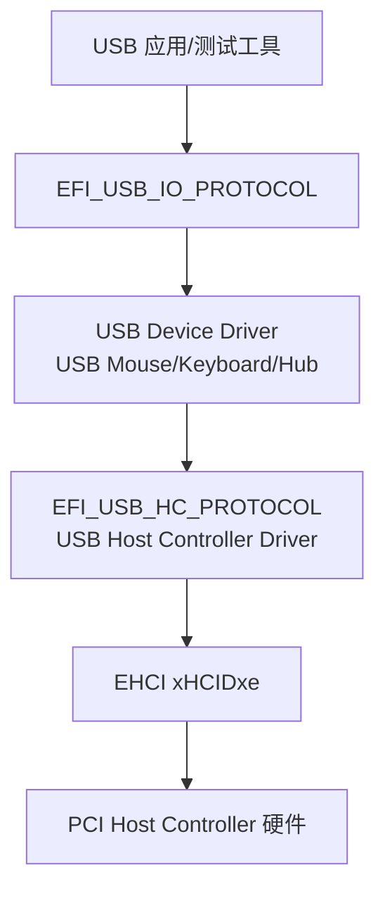
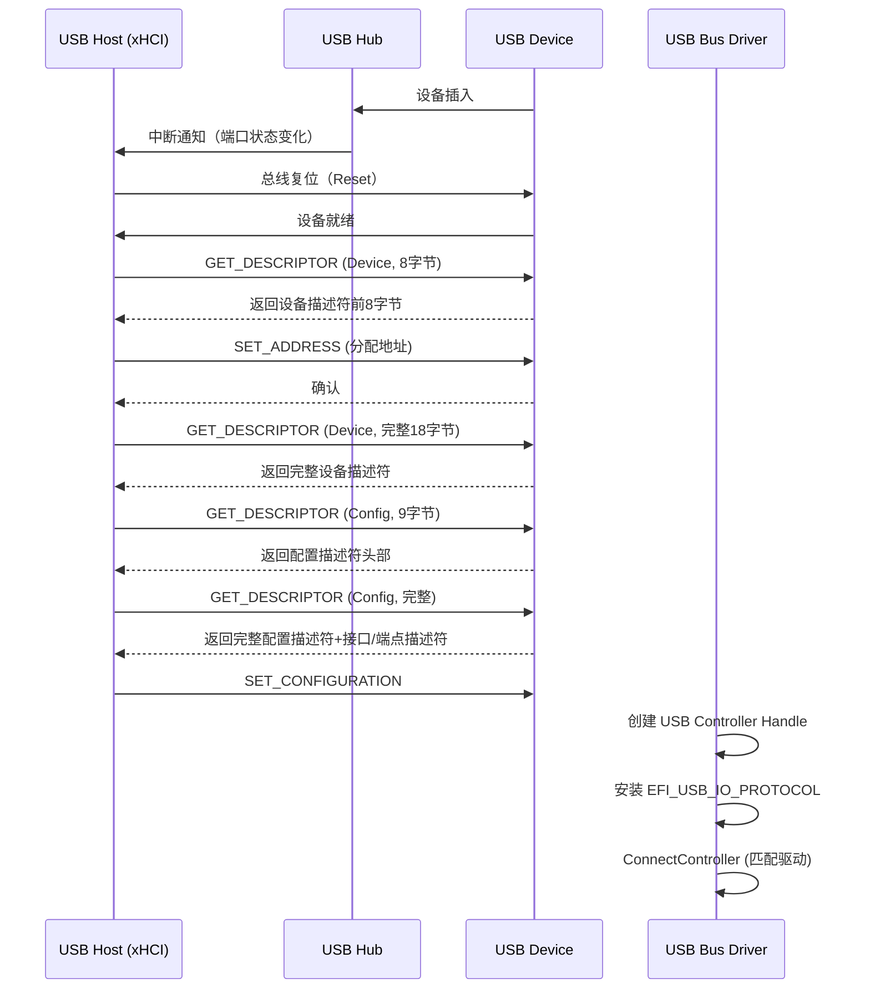
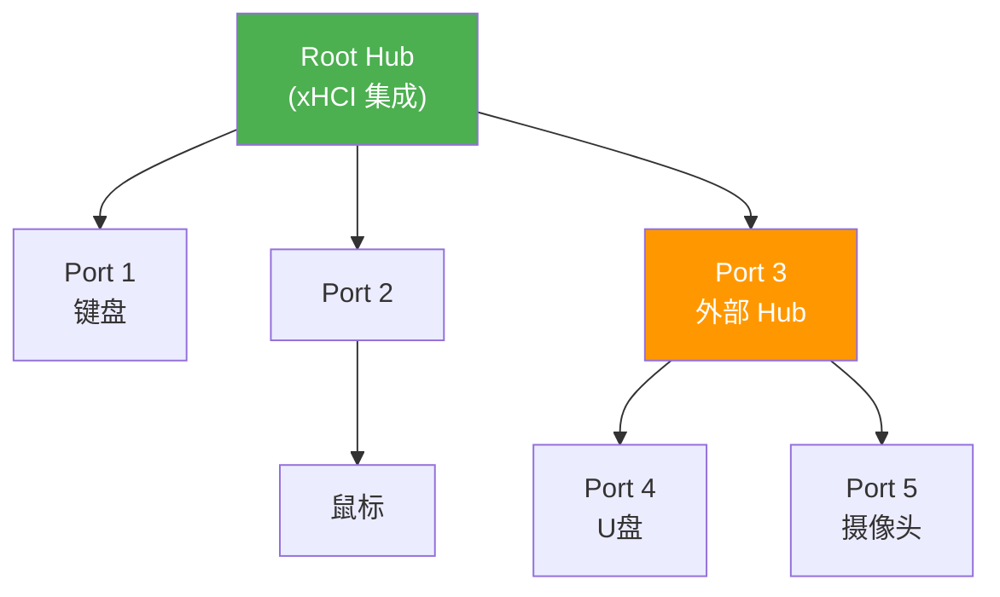

# USB与HID协议驱动

## 前言

**C：** 这篇文章带你了解 UEFI 下的 USB 架构和 HID 人机接口设备驱动开发。你会搞清楚 USB Host Controller 怎么工作、设备枚举的完整流程，以及怎么用 EFI_USB_IO_PROTOCOL 和 EFI_HID_PROTOCOL 与 USB 设备交互。键盘鼠标驱动就是 HID 的典型场景。

<!-- more -->

## USB 架构总览

USB（Universal Serial Bus）是现代计算机最重要的外设接口之一。在 UEFI 环境中，USB 驱动栈是分层的：



### USB Host Controller 类型

| 类型 | 速度 | UEFI 驱动模块 | 说明 |
|------|------|--------------|------|
| UHCI | USB 1.1 (12Mbps) | UhciDxe | Intel 通用主机控制器，较老旧 |
| OHCI | USB 1.1 (12Mbps) | OhciDxe | 开放主机控制器 |
| EHCI | USB 2.0 (480Mbps) | EhciDxe | 增强型主机控制器，当前主流 |
| xHCI | USB 3.x (5-20Gbps) | XhciDxe | 扩展型主机控制器，最新标准 |

::: tip 实际开发建议
新项目直接用 xHCI，它是 USB 3.0+ 的标准控制器，向下兼容 USB 2.0 和 1.1 设备。EDK II 中的 `XhciDxe` 已经非常成熟。
:::

## USB 设备枚举流程

USB 设备的枚举是热插拔检测 → 地址分配 → 描述符获取 → 配置选择的过程。在 UEFI 中，大部分工作由 USB Bus Driver 完成：



## USB 描述符结构

USB 通过描述符来描述设备的功能和接口：

### 设备描述符（Device Descriptor）

```c
typedef struct {
  UINT8  Length;           // 18
  UINT8  DescriptorType;   // 1
  UINT16 UsbVersion;       // BCD 版本号
  UINT8  DeviceClass;
  UINT8  DeviceSubClass;
  UINT8  DeviceProtocol;
  UINT8  MaxPacketSize0;   // 端点 0 最大包大小
  UINT16 VendorId;
  UINT16 ProductId;
  UINT16 DeviceVersion;
  UINT8  ManufacturerIndex; // 字符串描述符索引
  UINT8  ProductIndex;
  UINT8  SerialNumberIndex;
  UINT8  NumConfigurations;
} EFI_USB_DEVICE_DESCRIPTOR;
```

### 接口描述符（Interface Descriptor）

```c
typedef struct {
  UINT8  Length;           // 9
  UINT8  DescriptorType;   // 4
  UINT8  InterfaceNumber;
  UINT8  AlternateSetting;
  UINT8  NumEndpoints;
  UINT8  InterfaceClass;
  UINT8  InterfaceSubClass;
  UINT8  InterfaceProtocol;
  UINT8  Interface;
} EFI_USB_INTERFACE_DESCRIPTOR;
```

### 常见 USB 类代码

| Class Code | 类别 | 典型设备 |
|-----------|------|---------|
| 0x03 | HID（人机接口） | 键盘、鼠标、游戏手柄 |
| 0x0E | Video | 摄像头 |
| 0x08 | Mass Storage | U 盘、移动硬盘 |
| 0x0E | Audio | 声卡、麦克风 |
| 0x09 | Hub | USB 集线器 |

## EFI_USB_IO_PROTOCOL

这是 UEFI 中与 USB 设备交互的核心协议，由 USB Bus Driver 在枚举完成后安装。

### 主要接口

```c
typedef struct _EFI_USB_IO_PROTOCOL {
  // 控制传输
  EFI_USB_IO_CONTROL_TRANSFER       UsbControlTransfer;
  // 批量传输
  EFI_USB_IO_BULK_TRANSFER          UsbBulkTransfer;
  // 中断传输
  EFI_USB_IO_INTERRUPT_TRANSFER     UsbAsyncInterruptTransfer;
  // 同步中断传输
  EFI_USB_IO_SYNC_INTERRUPT_TRANSFER UsbSyncInterruptTransfer;
  // 等时传输
  EFI_USB_IO_ISOCHRONOUS_TRANSFER   UsbIsochronousTransfer;
  // 获取设备/接口/端点描述符
  EFI_USB_IO_GET_INTERFACE_DESCRIPTOR GetInterfaceDescriptor;
  EFI_USB_IO_GET_ENDPOINT_DESCRIPTOR GetEndpointDescriptor;
  // 端口重置
  EFI_USB_IO_PORT_RESET             UsbPortReset;
} EFI_USB_IO_PROTOCOL;
```

### 控制传输示例

```c
EFI_STATUS
UsbGetDeviceDescriptor (
  IN  EFI_USB_IO_PROTOCOL     *UsbIo,
  OUT EFI_USB_DEVICE_DESCRIPTOR *DevDesc
  )
{
  UINT32      Status;
  EFI_STATUS  Efirc;
  UINT32      TransferResult;

  Status = UsbIo->UsbControlTransfer (
                     UsbIo,
                     // bmRequestType: 方向=Device-to-Host, 类型=Standard, 接收方=Device
                     0x80,
                     // bRequest
                     USB_REQ_GET_DESCRIPTOR,
                     // wValue (Descriptor Type << 8 | Index)
                     (USB_DESC_TYPE_DEVICE << 8),
                     // wIndex
                     0,
                     // wLength
                     sizeof(EFI_USB_DEVICE_DESCRIPTOR),
                     DevDesc,
                     &TransferResult
                     );
  return (EFI_STATUS)Status;
}
```

## HID 协议

HID（Human Interface Device）是 USB 中专门用于人机交互设备的类。UEFI 为 HID 定义了专门的协议。

### EFI_HID_PROTOCOL

```c
#define EFI_HID_PROTOCOL_GUID \
  { 0x3AD37688, 0xD0E0, 0x4CC1, \
    { 0xB2, 0x12, 0x30, 0x56, 0x34, 0xA8, 0x49, 0x12 } }

typedef struct _EFI_HID_PROTOCOL {
  EFI_HID_GET_REPORT          GetReport;
  EFI_HID_SET_REPORT          SetReport;
  EFI_HID_GET_REPORT_DESCRIPTOR GetReportDescriptor;
  EFI_HID_SET_PROTOCOL        SetProtocol;
  EFI_HID_SET_IDLE            SetIdle;
  EFI_HID_GET_COUNTRYCode     GetCountryCode;
} EFI_HID_PROTOCOL;
```

::: details HID Report 机制
HID 设备通过 **Report（报告）** 来传递数据：
- **Input Report**：设备 → 主机（如按键状态）
- **Output Report**：主机 → 设备（如 LED 控制）
- **Feature Report**：双向配置数据

HID 的 Report 格式由 **Report Descriptor** 定义，这是一种描述数据格式的"描述符的描述符"，使用 Item 标签语法。
:::

### HID 键盘驱动核心代码

```c
#include <Uefi.h>
#include <Library/UefiLib.h>
#include <Library/UefiBootServicesTableLib.h>
#include <Protocol/UsbIo.h>
#include <Protocol/Hid.h>

#define HID_KEYBOARD_INPUT_REPORT_SIZE  8

typedef struct {
  EFI_USB_IO_PROTOCOL   *UsbIo;
  EFI_EVENT             InterruptEvent;
  VOID                  *InterruptBuffer;
} HID_KBD_CONTEXT;

// 中断传输回调
VOID
EFIAPI
HidKeyboardCallback (
  IN VOID    *Data,
  IN UINTN   DataLength,
  IN VOID    *Context,
  IN UINT32  Status
  )
{
  HID_KBD_CONTEXT *KbdCtx = (HID_KBD_CONTEXT *)Context;

  if (EFI_ERROR(Status)) {
    DEBUG((DEBUG_ERROR, "HID Keyboard transfer error: %r\n", Status));
    return;
  }

  // 解析 Input Report
  UINT8 *Report = (UINT8 *)Data;
  DEBUG((DEBUG_INFO, "HID Keyboard Report: "));
  for (UINTN i = 0; i < DataLength; i++) {
    DEBUG((DEBUG_INFO, "%02X ", Report[i]));
  }
  DEBUG((DEBUG_INFO, "\n"));

  // Bit 0: Left Ctrl, Bit 1: Left Shift, ... (Modifier Byte)
  // Byte 2-7: Key codes
}

// 异步中断传输 —— 持续接收键盘输入
EFI_STATUS
StartKeyboardPolling (
  IN HID_KBD_CONTEXT *KbdCtx
  )
{
  EFI_STATUS  Status;
  UINT8       Interval;   // 轮询间隔（ms）
  UINT8       EndpointAddr;

  // 获取中断端点地址（从接口描述符推断）
  EndpointAddr = 0x81;   // IN Endpoint 1，实际应从端点描述符读取
  Interval = 10;          // 10ms 轮询间隔

  // 分配接收缓冲区
  KbdCtx->InterruptBuffer = AllocatePool(HID_KEYBOARD_INPUT_REPORT_SIZE);

  // 启动异步中断传输
  Status = KbdCtx->UsbIo->UsbAsyncInterruptTransfer (
                            KbdCtx->UsbIo,
                            EndpointAddr,           // 端点地址
                            TRUE,                    // 开启
                            Interval,                // 轮询间隔
                            HID_KEYBOARD_INPUT_REPORT_SIZE,
                            HidKeyboardCallback,      // 回调函数
                            KbdCtx                    // 上下文
                            );
  return Status;
}
```

### 使用 EFI_HID_PROTOCOL 获取报告描述符

```c
EFI_STATUS
GetHidReportDescriptor (
  IN  EFI_HID_PROTOCOL  *Hid,
  OUT UINT8             **DescriptorBuffer,
  OUT UINTN             *DescriptorSize
  )
{
  EFI_STATUS  Status;

  // 先获取 Report Descriptor 的大小
  Status = Hid->GetReportDescriptor(
                  Hid,
                  NULL,
                  0,
                  DescriptorSize
                  );
  if (Status == EFI_BUFFER_TOO_SMALL) {
    // 分配缓冲区并再次获取
    *DescriptorBuffer = AllocatePool(*DescriptorSize);
    if (*DescriptorBuffer == NULL) return EFI_OUT_OF_RESOURCES;

    Status = Hid->GetReportDescriptor(
                    Hid,
                    *DescriptorBuffer,
                    *DescriptorSize,
                    DescriptorSize
                    );
  }
  return Status;
}
```

## USB Hub 拓扑

USB Hub 是 USB 拓扑的核心，它允许级联连接最多 127 个设备：



::: warning Hub 级联限制
USB 规范规定最多允许 **7 层 Hub 级联**（包括 Root Hub），每个 Hub 向下最多 **5 层**。超过限制的设备将无法被识别。
:::

### USB Hub Driver 在 UEFI 中的工作

USB Hub Driver 是一个 **Bus Driver**，它的核心工作：

1. **监控端口状态变化** —— 通过中断端点或轮询
2. **检测设备插入/拔出** —— 端口状态寄存器
3. **为子设备创建 Handle** —— 安装 Device Path 和 USB IO Protocol
4. **递归 ConnectController** —— 让系统匹配子设备驱动

## 完整的 HID 驱动 Supported/Start 示例

```c
// Supported：检测是否为 HID 设备
EFI_STATUS
EFIAPI
MyHidDriverSupported (
  IN EFI_DRIVER_BINDING_PROTOCOL  *This,
  IN EFI_HANDLE                   Controller,
  IN EFI_DEVICE_PATH_PROTOCOL     *RemainingPath
  )
{
  EFI_STATUS            Status;
  EFI_USB_IO_PROTOCOL   *UsbIo;
  EFI_USB_INTERFACE_DESCRIPTOR IfDesc;

  Status = gBS->OpenProtocol(
                  Controller,
                  &gEfiUsbIoProtocolGuid,
                  (VOID **)&UsbIo,
                  This->DriverBindingHandle,
                  Controller,
                  EFI_OPEN_PROTOCOL_TEST_PROTOCOL
                  );
  if (EFI_ERROR(Status)) return EFI_UNSUPPORTED;

  Status = UsbIo->GetInterfaceDescriptor(UsbIo, &IfDesc);
  if (EFI_ERROR(Status)) return EFI_UNSUPPORTED;

  // 检查是否为 HID 接口 (Class = 0x03)
  if (IfDesc.InterfaceClass == USB_CLASS_HID) {
    return EFI_SUCCESS;
  }
  return EFI_UNSUPPORTED;
}

// Start：绑定设备，开始接收数据
EFI_STATUS
EFIAPI
MyHidDriverStart (
  IN EFI_DRIVER_BINDING_PROTOCOL  *This,
  IN EFI_HANDLE                   Controller,
  IN EFI_DEVICE_PATH_PROTOCOL     *RemainingPath
  )
{
  EFI_STATUS           Status;
  EFI_USB_IO_PROTOCOL  *UsbIo;
  HID_KBD_CONTEXT      *KbdCtx;

  Status = gBS->OpenProtocol(
                  Controller,
                  &gEfiUsbIoProtocolGuid,
                  (VOID **)&UsbIo,
                  This->DriverBindingHandle,
                  Controller,
                  EFI_OPEN_PROTOCOL_BY_DRIVER
                  );
  if (EFI_ERROR(Status)) return Status;

  KbdCtx = AllocateZeroPool(sizeof(*KbdCtx));
  if (!KbdCtx) {
    gBS->CloseProtocol(Controller, &gEfiUsbIoProtocolGuid,
                       This->DriverBindingHandle, Controller);
    return EFI_OUT_OF_RESOURCES;
  }
  KbdCtx->UsbIo = UsbIo;

  // USB 设备使用默认配置（Configuration 1）
  UsbIo->UsbControlTransfer(
      UsbIo, 0x00,  // bmRequestType
      USB_REQ_SET_CONFIGURATION,
      1,            // Configuration Value
      0, 0, NULL, NULL
      );

  // 启动异步中断传输，轮询 HID Input Report
  Status = StartKeyboardPolling(KbdCtx);
  if (EFI_ERROR(Status)) {
    FreePool(KbdCtx);
    gBS->CloseProtocol(Controller, &gEfiUsbIoProtocolGuid,
                       This->DriverBindingHandle, Controller);
    return Status;
  }

  return EFI_SUCCESS;
}
```

## 小结

这篇文章覆盖了 UEFI 下 USB 和 HID 驱动开发的关键知识点：

- **USB 驱动栈是分层的**：Host Controller Driver → USB Bus Driver → USB Device Driver
- **设备枚举**由 USB Bus Driver 自动完成，你只需通过 `EFI_USB_IO_PROTOCOL` 与设备通信
- **USB 描述符**（设备/接口/端点）是理解设备功能的基础
- **HID 类**通过 Report 机制传递输入输出数据，`EFI_HID_PROTOCOL` 提供了标准化的访问接口
- **异步中断传输**是 HID 设备（键盘、鼠标）获取输入数据的常用方式

掌握了这些，你就能理解 UEFI 中键盘鼠标驱动的原理，也可以为其他 USB HID 设备（游戏手柄、触摸板等）编写驱动。
