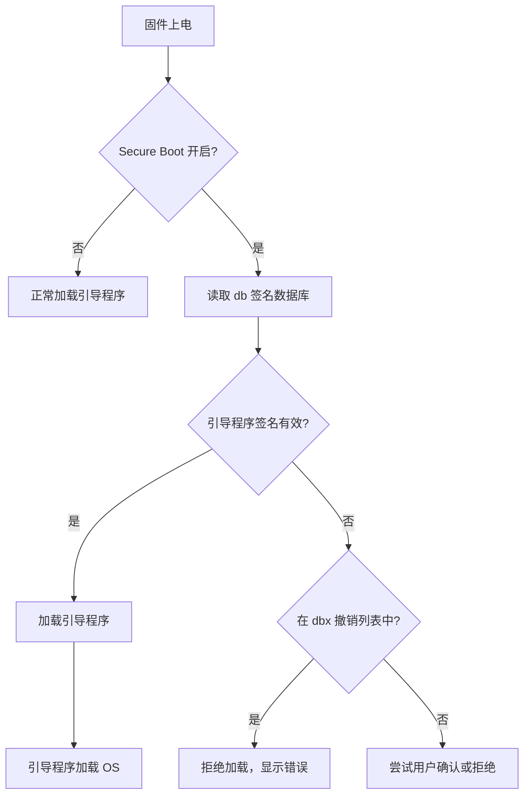
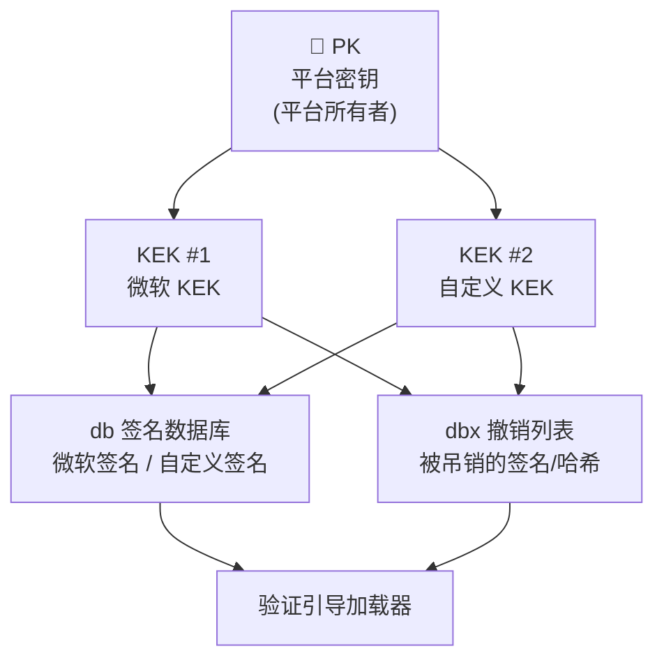
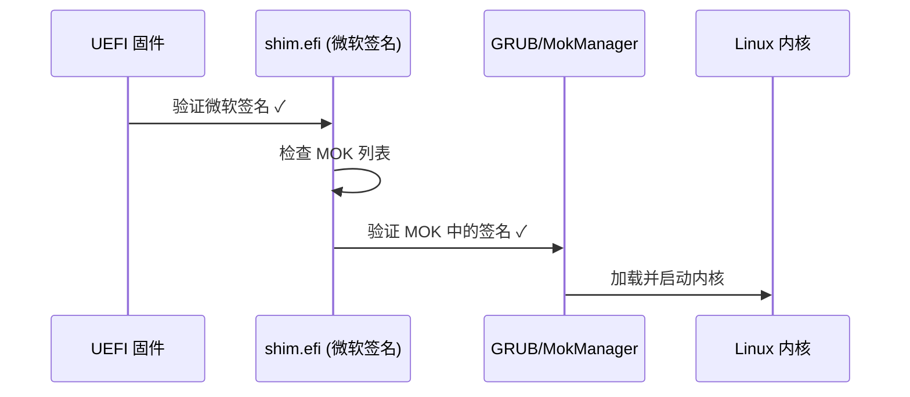

# Secure Boot 安全启动详解

## 前言

**C：** 今天我们来聊 UEFI 安全里最重要的一块——Secure Boot。如果你想知道为什么现代电脑能防止恶意软件在系统启动前动手脚，这篇文章就是为你准备的。读完之后你会彻底搞懂密钥层级、签名流程，以及 Linux 下面那些 shim、MOK 到底在干什么。

<!-- more -->

## 什么是 Secure Boot

Secure Boot 是 UEFI 规范定义的一种安全机制，它确保平台只加载被信任的代码来执行。简单来说，**固件在加载每个引导程序之前，都会验证它的数字签名**，如果签名不对，就直接拒绝执行。

在 Secure Boot 出现之前，BIOS 时代对引导程序没有任何验证，恶意软件（比如 Bootkit）可以在操作系统之前运行，几乎无法被检测到。



## 密钥层级：PK / KEK / db / dbx

Secure Boot 的信任体系基于一个**四级密钥层级**：

| 密钥 | 全称 | 作用 | 典型持有者 |
|------|------|------|-----------|
| **PK** | Platform Key | 平台密钥，最高信任锚点 | OEM / 主板厂商 |
| **KEK** | Key Exchange Key | 密钥交换密钥，用于签名 db/dbx | OEM / OS 厂商 |
| **db** | Signature Database | 签名数据库，存储允许的签名/哈希 | 由 KEK 签名更新 |
| **dbx** | Forbidden Signature Database | 撤销列表，存储被禁止的签名/哈希 | 由 KEK 签名更新 |



### 各密钥详细说明

**PK（Platform Key）** 是整个信任链的根。每个平台只有一个 PK。更换 PK 意味着重置整个信任链——所有旧的 KEK、db、dbx 都会失效。

**KEK（Key Exchange Key）** 是中间层密钥。平台可以有多个 KEK，比如微软有一个 KEK，你也可以添加自己的 KEK。KEK 的作用是**授权对 db 和 dbx 的更新操作**。

**db** 里面存的是被信任的签名和文件哈希。固件在验证引导程序时，会检查其签名是否匹配 db 中的某条记录。

**dbx** 则是"黑名单"，里面存的是已知有问题的签名或哈希（比如被泄露的签名密钥）。

## 验证链的工作流程

当 Secure Boot 启用时，固件验证引导程序的完整流程如下：

1. 固件读取 PK，验证 PK 的完整性
2. 固件使用 PK 验证 KEK 列表
3. 固件使用 KEK 验证 db 和 dbx 的完整性和合法性
4. 当需要加载某个 EFI 应用时，固件检查该应用的签名/哈希是否在 db 中
5. 同时检查是否在 dbx 撤销列表中
6. 通过验证才允许加载执行

::: tip 信任链
PK → KEK → db/dbx → 引导程序 → 操作系统内核。每一层都由上一层来信任和验证，形成完整的信任链（Chain of Trust）。
:::

## 用 OpenSSL 签名 UEFI 应用

在自定义 Secure Boot 场景中，你需要自己生成密钥并签名 EFI 应用。下面是完整步骤：

### 1. 生成密钥对

```bash
# 生成平台密钥 (PK)
openssl genrsa -out PK.key 2048
openssl req -new -x509 -key PK.key -out PK.crt -days 3650 \
    -subj "/CN=My Platform Key/"

# 生成密钥交换密钥 (KEK)
openssl genrsa -out KEK.key 2048
openssl req -new -x509 -key KEK.key -out KEK.crt -days 3650 \
    -subj "/CN=My Key Exchange Key/"

# 生成签名密钥 (db)
openssl genrsa -out db.key 2048
openssl req -new -x509 -key db.key -out db.crt -days 3650 \
    -subj "/CN=My Signature Key/"
```

### 2. 创建 EFI 签名列表

UEFI 固件使用特定的**EFI Signature List（ESL）**格式来存储签名。可以用 `sign-tool`（sbkeysync 或 sbsigntools）来创建：

```bash
# 使用 sbsigntool 直接签名 EFI 应用
sbsigntool sign --key db.key --cert db.crt --output myapp_signed.efi myapp.efi

# 验证签名
sbverify --cert db.crt myapp_signed.efi
```

### 3. 注册密钥到固件

有几种方式可以将密钥注册到固件：

**方式一：通过固件 UI（ Setup 界面）**

大多数主板在 BIOS Setup 中提供 Secure Boot Key Management 界面，可以直接导入 `.cer` 或 `.esl` 文件。

**方式二：使用 KeyTool.efi**

```bash
# 在 UEFI Shell 中运行 KeyTool
# KeyTool.efi 是 sbkeysync 包的一部分，提供交互式密钥管理
```

**方式三：使用 FirmwareSetup 服务**

通过 Linux 下的 `efivarfs` 或 Windows 的 `SetFirmwareEnvironmentVariable` API 进行编程注册。

## Linux 下的 Secure Boot：shim 与 MOK

Linux 发行版是如何在 Secure Boot 环境下运行的？关键就是 **shim** 和 **MOK（Machine Owner Key）**。



### shim.efi 的工作原理

微软向 Linux 发行版发放签名证书，用这些证书签名后的 `shim.efi` 被预装在 db 中。shim 本身是一个迷你的引导加载器，它会：

1. 被 UEFI 固件用微软签名验证通过
2. 然后用**用户自己信任的密钥（MOK）**去验证后续的 GRUB 和内核
3. 这样就形成了一个"信任桥梁"

### MOK（Machine Owner Key）

MOK 是用户自定义的密钥列表，存储在一个专用的 EFI 变量中。添加 MOK 的流程：

```bash
# 1. 导入你的密钥到 MOK 列表
sudo mokutil --import my_key.der

# 2. 重启后会出现 MokManager 界面，要求你输入一次性密码来确认
# 3. 确认后密钥被写入 MOK 变量

# 查看 MOK 列表
mokutil --list-enrolled

# 查看 Secure Boot 状态
mokutil --sb-state
```

::: warning 安全提醒
MOK 密钥拥有与 db 密钥同等的权限。务必妥善保管你的私钥，泄露后别人可以签名任意 EFI 程序在你的机器上运行。
:::

## 常见 Secure Boot 问题与调试

### 问题 1：引导程序签名被拒绝

**现象：** 启动时出现 `Security Violation` 或直接卡住。

**排查步骤：**

```bash
# 检查 Secure Boot 状态
mokutil --sb-state

# 检查 EFI 变量是否正常
efibootmgr -v

# 查看固件日志（如果有）
journalctl -b -k | grep -i "secure"
```

### 问题 2：内核模块被拒绝加载

Secure Boot 还会阻止加载未签名的内核模块。解决方案：

- 使用 `kmod` 签名机制对模块签名（需将公钥加入内核信任环）
- 临时关闭 Secure Boot（开发阶段）
- 使用 DKMS 自动构建并签名模块

### 问题 3：更新后签名验证失败

可能是 dbx 更新导致某个旧签名被撤销。检查：

```bash
# 查看 dbx 内容
mokutil --dbx
```

### 调试技巧

| 方法 | 说明 |
|------|------|
| 临时关闭 Secure Boot | BIOS Setup → Secure Boot → Disabled |
| 使用 `shim --verbose` | 查看详细的签名验证日志 |
| 检查时间戳 | 系统时钟不对会导致证书过期验证失败 |
| 使用 OVMF 测试 | QEMU + OVMF 模拟环境，方便反复调试 |

## 小结

Secure Boot 通过 PK → KEK → db/dbx 的密钥层级，建立了从固件到操作系统的完整信任链。理解这个体系后，你就能自如地管理自定义密钥、签名自己的 EFI 应用，并在 Linux 环境下利用 shim + MOK 灵活地部署引导程序。安全不是束缚，而是给你信心——你跑的每一行代码都是你信任的。
