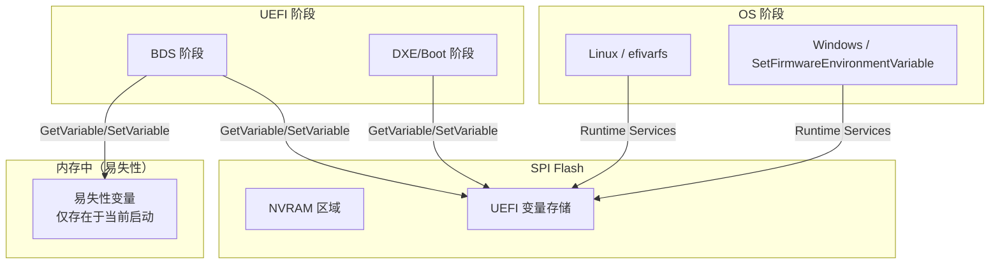
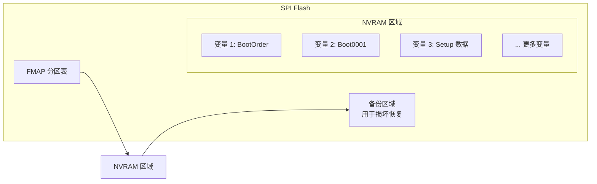

# UEFI 变量与运行时服务

## 前言

**C：** UEFI 变量和运行时服务是 UEFI 中"没那么炫酷但绝对离不开"的基础设施。启动顺序存在哪？系统时间怎么读？固件怎么让操作系统调用？这篇文章带你把这两个话题彻底搞明白。

<!-- more -->

## UEFI 变量概述

UEFI 变量是一种**键值对形式的持久化存储**，用于在固件、引导程序和操作系统之间传递数据。它们类似于环境变量，但存储在非易失性存储中（通常是 SPI Flash 上的 NVRAM 区域）。

### GetVariable / SetVariable

UEFI 变量通过 `Runtime Services` 中的两个核心接口操作：

```c
// 读取变量
EFI_STATUS
EFIAPI GetVariable(
    IN  CHAR16    *VariableName,    // 变量名（宽字符）
    IN  EFI_GUID  *VendorGuid,      // 厂商 GUID
    OUT UINT32    *Attributes,      // 属性标志
    IN OUT UINTN  *DataSize,        // 数据大小
    OUT VOID      *Data             // 数据缓冲区
);

// 写入/创建变量
EFI_STATUS
EFIAPI SetVariable(
    IN CHAR16     *VariableName,    // 变量名
    IN EFI_GUID   *VendorGuid,      // 厂商 GUID
    IN UINT32     Attributes,       // 属性标志
    IN UINTN      DataSize,         // 数据大小
    IN VOID       *Data             // 数据缓冲区
);
```

### 变量属性

每个 UEFI 变量都有一组属性标志（Attributes），控制它的行为：

| 属性 | 值 | 说明 |
|------|-----|------|
| `EFI_VARIABLE_NON_VOLATILE` | 0x01 | 非易失性存储，掉电不丢失 |
| `EFI_VARIABLE_BOOTSERVICE_ACCESS` | 0x02 | 启动服务阶段可访问 |
| `EFI_VARIABLE_RUNTIME_ACCESS` | 0x04 | 操作系统运行时也可访问 |
| `EFI_VARIABLE_HARDWARE_ERROR_RECORD` | 0x08 | 硬件错误记录 |
| `EFI_VARIABLE_AUTHENTICATED_WRITE_ACCESS` | 0x10 | 需要认证才能写入 |
| `EFI_VARIABLE_TIME_BASED_AUTHENTICATED_WRITE_ACCESS` | 0x20 | 基于时间的认证写入 |
| `EFI_VARIABLE_ENHANCED_AUTHENTICATED_ACCESS` | 0x40 | 增强认证访问 |

::: tip 常见组合
最常用的组合是 `NON_VOLATILE | BOOTSERVICE_ACCESS | RUNTIME_ACCESS`（0x07），表示变量在所有阶段都可访问且持久化存储。
:::

## 变量存储架构



### NV（非易失性）vs Volatile（易失性）

**非易失性变量**存储在 SPI Flash 上的 NVRAM 区域中，断电后数据不会丢失。所有设置了 `EFI_VARIABLE_NON_VOLATILE` 属性的变量都属于这一类。

**易失性变量**只存在于内存中，系统断电或重启后就会消失。它们主要用于启动过程中的临时数据传递。

::: warning NVRAM 空间有限
NVRAM 空间通常只有 64KB ~ 256KB。如果写入过多非易失性变量，可能导致 NVRAM 溢出，严重时固件会自动清除并重置为默认值（俗称"NVRAM 清空"或"CMOS 放电"）。
:::

## 认证变量（Authenticated Variables）

从 UEFI 2.3.1 开始引入了**认证变量**机制，主要用于 Secure Boot 相关的安全变量（如 PK、KEK、db、dbx）。这类变量的写入需要提供合法的数字签名：

```c
// 认证变量的 SetVariable 调用
// Data 字段中包含 WIN_CERTIFICATE_UEFI_GUID 结构
// 固件会验证签名后再决定是否更新变量

typedef struct {
    WIN_CERTIFICATE    Hdr;
    EFI_GUID           CertType;  // EFI_CERT_TYPE_RSA2048_SHA256_GUID
    UINT8              CertData[];
} WIN_CERTIFICATE_UEFI_GUID;
```

认证变量确保了安全相关的变量不能被随意篡改——只有拥有对应私钥的实体才能更新它们。

## 常见 UEFI 变量

### 启动相关变量

| 变量名 | GUID | 说明 |
|--------|------|------|
| `BootCurrent` | `gEfiGlobalVariableGuid` | 当前启动项编号 |
| `BootNext` | `gEfiGlobalVariableGuid` | 下次启动使用的启动项编号 |
| `BootOrder` | `gEfiGlobalVariableGuid` | 启动顺序列表（UINT16 数组） |
| `BootXXXX` | `gEfiGlobalVariableGuid` | 具体的启动项定义（XXXX = 0000-FFFF） |
| `BootOptionSupport` | `gEfiGlobalVariableGuid` | 支持的启动选项特性标志 |

### 安全相关变量

| 变量名 | GUID | 说明 |
|--------|------|------|
| `PK` | `gEfiGlobalVariableGuid` | 平台密钥 |
| `KEK` | `gEfiGlobalVariableGuid` | 密钥交换密钥 |
| `db` | `gEfiSecurityDatabaseGuid` | 签名数据库 |
| `dbx` | `gEfiSecurityDatabaseGuid` | 撤销列表 |
| `MokList` | `gMokOwnerGuid` | MOK 密钥列表（shim 用） |

### 使用 efibootmgr 管理启动变量

```bash
# 查看所有启动项
efibootmgr -v

# 创建新的启动项
efibootmgr -c -d /dev/nvme0n1 -p 1 -L "My Linux" -l '\EFI\linux\vmlinuz.efi'

# 修改启动顺序
efibootmgr -o 0001,0002,0003

# 删除启动项
efibootmgr -b 0002 -B

# 设置下次启动项
efibootmgr -n 0003
```

## 运行时服务（Runtime Services）

运行时服务是固件提供的一组在操作系统运行期间仍然可用的接口。它们在 UEFI 规范的 EFI_SYSTEM_TABLE 中通过 `RuntimeServices` 指针暴露。

### 核心运行时服务

| 服务 | 说明 |
|------|------|
| `GetTime` / `SetTime` | 获取/设置系统时间和日期 |
| `GetWakeupTime` / `SetWakeupTime` | 获取/设置唤醒时间（闹钟） |
| `ResetSystem` | 系统重置（冷启动、热启动、关机） |
| `GetNextMonotonicCount` | 获取单调递增计数器（用于时间测量） |
| `GetNextHighMonotonicCount` | 获取高 32 位单调计数器 |
| `SetVirtualAddressMap` | 转换为虚拟地址映射（启动→运行时切换） |
| `ConvertPointer` | 指针地址转换 |
| `GetVariable` / `SetVariable` / `GetNextVariableName` | 变量服务 |
| `UpdateCapsule` / `QueryCapsuleCapabilities` | Capsule 更新服务 |

### 时间服务示例

```c
#include <Uefi.h>

EFI_STATUS GetSystemTime(EFI_SYSTEM_TABLE *ST)
{
    EFI_TIME Time;
    EFI_STATUS Status;

    Status = ST->RuntimeServices->GetTime(&Time, NULL);
    if (EFI_ERROR(Status)) {
        return Status;
    }

    // Time.Year, Time.Month, Time.Day
    // Time.Hour, Time.Minute, Time.Second
    // Time.Nanosecond, Time.TimeZone, Time.Daylight

    return EFI_SUCCESS;
}
```

### 系统重置

```c
// 冷启动（完全断电再上电）
gRT->ResetSystem(EfiResetCold, EFI_SUCCESS, 0, NULL);

// 热启动（不切断电源）
gRT->ResetSystem(EfiResetWarm, EFI_SUCCESS, 0, NULL);

// 关机
gRT->ResetSystem(EfiResetShutdown, EFI_SUCCESS, 0, NULL);

// 带错误码重置
gRT->ResetSystem(EfiResetShutdown, EFI_ABORTED, 0, NULL);
```

## 从操作系统调用运行时服务

操作系统通过两种主要方式访问运行时服务：

### Linux：efivarfs

```bash
# efivarfs 挂载点
ls /sys/firmware/efi/efivars/

# 读取变量
xxd /sys/firmware/efi/efivars/BootOrder-8be4df61-93ca-11d2-aa0d-00e098032b8c

# 写入变量（需要 root）
printf '\x03\x00' > /sys/firmware/efi/efivars/BootNext-8be4df61-93ca-11d2-aa0d-00e098032b8c
```

### Linux 内核中调用

```c
// Linux 内核使用 efi.runtime_service 访问
#include <linux/efi.h>

// 通过 Runtime Services 获取变量
efi_get_variable(efi_char16_t *name, efi_guid_t *vendor,
                 u32 *attr, unsigned long *data_size, void *data);

// 重置系统
efi.reset_system(EFI_RESET_COLD, EFI_SUCCESS, 0, NULL);
```

### Windows

```c
// Windows 使用 SetFirmwareEnvironmentVariable 系列函数
#include <windows.h>

// 读取 UEFI 变量
DWORD WINAPI GetFirmwareEnvironmentVariableW(
    LPCWSTR lpName,       // 变量名
    LPCWSTR lpGuid,       // GUID 字符串 "{xxxxxxxx-xxxx-...}"
    PVOID  pBuffer,       // 输出缓冲区
    DWORD  nSize          // 缓冲区大小
);

// 写入 UEFI 变量
BOOL WINAPI SetFirmwareEnvironmentVariableW(
    LPCWSTR lpName,
    LPCWSTR lpGuid,
    PVOID  pValue,
    DWORD  nSize
);
```

## 变量存储在 NVRAM/Flash 上的布局

UEFI 变量通常存储在 SPI Flash 上的一个专用区域。不同固件实现有不同的存储格式：



::: details 耐久性考虑
SPI Flash 有写入次数限制（通常 10 万~100 万次擦写循环）。频繁写入非易失性变量（尤其是日志类数据）会加速 Flash 老化。因此：
- 避免在循环中频繁调用 SetVariable
- 日志信息优先使用易失性变量或内存缓冲区
- 生产环境的固件应该监控写入次数
:::

## 小结

UEFI 变量和运行时服务构成了固件与操作系统之间的桥梁。变量提供了持久化的数据存储能力，而运行时服务让操作系统在启动完成后仍能调用固件功能。掌握 GetVariable/SetVariable 的使用、理解 NV 与易失性变量的区别、熟悉 efibootmgr 等工具，是 UEFI 开发者的基本功。
