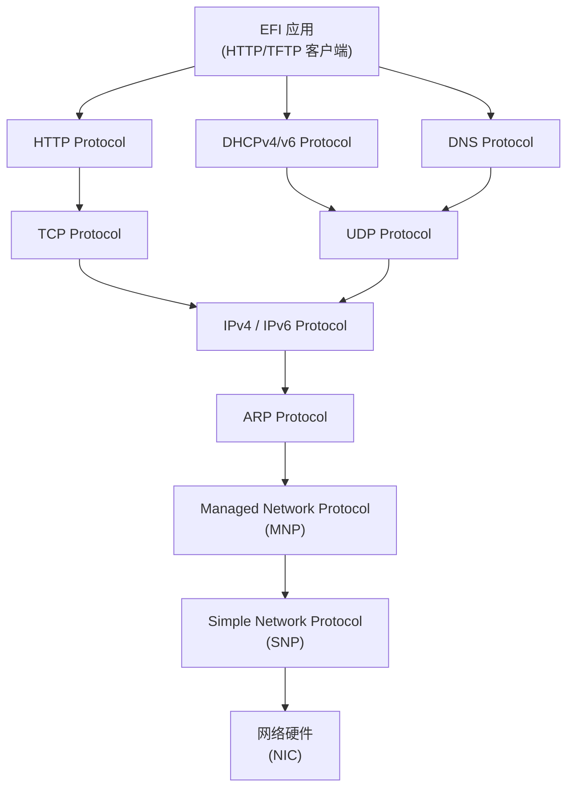
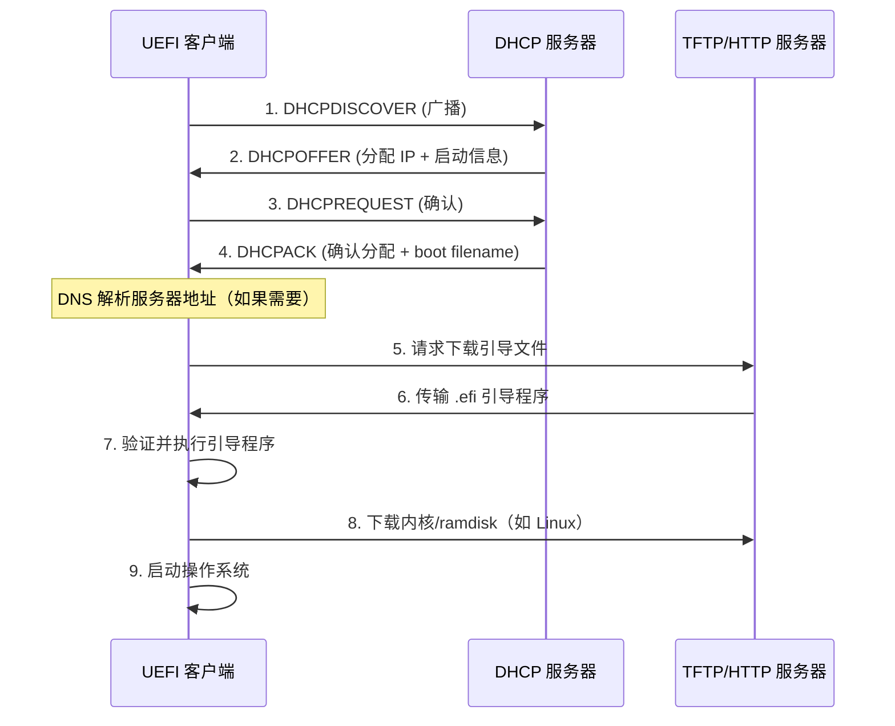

# UEFI 网络协议栈与 PXE 启动

## 前言

**C：** 没有网络能力的固件就像没有 WiFi 的手机——能用但不方便。UEFI 内置了完整的 TCP/IP 网络协议栈，可以直接通过网络下载文件、PXE 引导启动。这篇文章带你从协议分层到实战代码，把 UEFI 网络编程彻底拿下。

<!-- more -->

## UEFI 网络协议栈架构

与传统 BIOS 下 PXE 依赖网卡 ROM 中的 UNDI 驱动不同，UEFI 提供了一套**分层模块化**的网络协议栈，每层都是一个独立的 EFI Protocol：



### 各层协议简介

| 协议 | Protocol GUID | 说明 |
|------|--------------|------|
| **SNP** | `EFI_SIMPLE_NETWORK_PROTOCOL` | 最底层的网络接口驱动，直接操作网卡 |
| **MNP** | `EFI_MANAGED_NETWORK_PROTOCOL` | 提供 VLAN、多播过滤等管理功能 |
| **ARP** | `EFI_ARP_PROTOCOL` | ARP 地址解析 |
| **IP4** | `EFI_IP4_PROTOCOL` | IPv4 协议实现 |
| **IP6** | `EFI_IP6_PROTOCOL` | IPv6 协议实现 |
| **UDP4** | `EFI_UDP4_PROTOCOL` | UDP 协议（DHCP、DNS、TFTP 等基于此） |
| **TCP4** | `EFI_TCP4_PROTOCOL` | TCP 协议（HTTP 等基于此） |
| **DHCP4** | `EFI_DHCP4_PROTOCOL` | DHCP 客户端 |
| **HTTP** | `EFI_HTTP_PROTOCOL` | HTTP 客户端（UEFI 2.5+） |

## 网络接口标识协议

`EFI_NETWORK_INTERFACE_IDENTIFIER_PROTOCOL`（也叫 NII Protocol）是网络设备的基础标识协议：

```c
#define EFI_NETWORK_INTERFACE_IDENTIFIER_PROTOCOL_REVISION 0x00020000

typedef struct {
    UINT64   Revision;      // 协议版本
    UINT64   MajorVer;      // UNDI major version
    UINT64   MinorVer;      // UNDI minor version
    UINT16   Ipv6Supported; // 是否支持 IPv6
    UINT16   IfNum;         // 接口编号
    UINT32   StringId[4];   // 字符串标识
} EFI_NETWORK_INTERFACE_IDENTIFIER_PROTOCOL;
```

## PXE 启动流程

PXE（Preboot eXecution Environment）是从网络引导操作系统的标准机制。UEFI 下的 PXE 流程比传统 BIOS 更灵活：



### UEFI PXE vs 传统 PXE

| 特性 | 传统 PXE（BIOS） | UEFI PXE |
|------|-----------------|----------|
| 引导文件格式 | NBP（.0 文件） | EFI 应用（.efi 文件） |
| 传输协议 | TFTP | TFTP / HTTP / HTTPS |
| 服务器配置 | `pxelinux.cfg/default` | 直接指定 .efi 文件路径 |
| 加密支持 | 无 | 支持 HTTPS |
| IPv6 | 不支持 | 支持 |

## 配置 PXE 服务器

### 基础 DHCP + TFTP 配置

以 dnsmasq 为例：

```bash
# 安装 dnsmasq
sudo apt install dnsmasq

# /etc/dnsmasq.conf 配置
interface=eth0
bind-interfaces

# DHCP 配置
dhcp-range=192.168.1.100,192.168.1.200,12h
dhcp-boot=bootx64.efi               # UEFI 客户端引导文件
dhcp-option=option:tftp,192.168.1.1  # TFTP 服务器地址
enable-tftp
tftp-root=/var/lib/tftpboot          # TFTP 根目录
```

### 目录结构

```
/var/lib/tftpboot/
├── bootx64.efi          # GRUB / systemd-boot / iPXE
├── grub/
│   └── grub.cfg         # GRUB 配置
├── vmlinuz              # Linux 内核
├── initrd.img           # initramfs
└── efi/
    └── boot/
        └── bootx64.efi  # 遵循 ESP 启动路径
```

## iPXE 增强

[iPXE](https://ipxe.org/) 是 PXE 的增强版，支持 HTTP/HTTPS/iSCSI 等更多协议和特性：

::: details iPXE 的主要优势
- 支持 HTTP/HTTPS 下载（比 TFTP 快得多）
- 支持无线网络
- 支持链式加载其他 iPXE 脚本
- 支持域名、iSCSI、AoE 等存储协议
- 内置脚本引擎，可以做复杂的启动逻辑
:::

### 编译 iPXE

```bash
# 克隆源码
git clone https://github.com/ipxe/ipxe.git
cd ipxe/src

# 编译为 EFI 应用
make bin-x86_64-efi/ipxe.efi

# 产物在 bin-x86_64-efi/ipxe.efi
# 将其放到 TFTP 目录下，让 DHCP 指向它
```

### iPXE 脚本示例

```bash
#!ipxe
# iPXE 启动脚本

# 通过 HTTP 获取菜单
menu iPXE Boot Menu
item linux   Boot Linux (HTTP)
item win     Boot Windows (iSCSI)
item shell   Drop to iPXE Shell

choose --default linux --timeout 5000 selected || goto shell
goto ${selected}

:linux
# 通过 HTTP 下载内核和 initrd
kernel http://192.168.1.1/boot/vmlinuz \
    initrd=initrd.img \
    ip=dhcp \
    root=/dev/nfs:192.168.1.1:/export/root
initrd http://192.168.1.1/boot/initrd.img
boot

:win
# iSCSI 启动 Windows
sanboot iscsi:192.168.1.1::::iqn.2024-01.com.example:win

:shell
echo Type 'exit' to get back to the menu
shell
```

## 实战：在 UEFI 中通过 HTTP 下载文件

下面这段代码展示了如何在 UEFI 应用中使用 HTTP 协议下载文件：

```c
#include <Uefi.h>
#include <Protocol/Http.h>
#include <Protocol/ServiceBinding.h>
#include <Library/UefiBootServicesTableLib.h>

EFI_STATUS DownloadViaHttp(
    EFI_IPv4_ADDRESS *ServerIp,
    CHAR16           *FilePath,
    UINT8            **Buffer,
    UINTN            *BufferSize
)
{
    EFI_STATUS                Status;
    EFI_HTTP_PROTOCOL         *Http;
    EFI_HTTP_CONFIG_DATA      HttpConfig;
    EFI_HTTP_REQUEST_DATA     RequestData;
    EFI_HTTP_MESSAGE          RequestMsg;
    EFI_HTTP_TOKEN            ResponseToken;
    EFI_HTTP_HEADER           Headers[2];

    // 1. 定位 HTTP Service Binding Protocol
    EFI_SERVICE_BINDING_PROTOCOL *HttpSb;
    Status = gBS->LocateProtocol(
        &gEfiHttpServiceBindingProtocolGuid, NULL, (VOID **)&HttpSb
    );
    if (EFI_ERROR(Status)) return Status;

    // 2. 创建 HTTP 子实例
    Status = HttpSb->CreateChild(HttpSb, &Http);
    if (EFI_ERROR(Status)) return Status;

    // 3. 配置 HTTP（指定目标 IP）
    ZeroMem(&HttpConfig, sizeof(HttpConfig));
    HttpConfig.HttpVersion = HttpVersion11;
    HttpConfig.AccessPoint.IPv4Node = *ServerIp;

    Status = Http->Configure(Http, &HttpConfig);
    if (EFI_ERROR(Status)) goto cleanup;

    // 4. 构建 HTTP GET 请求
    ZeroMem(&RequestData, sizeof(RequestData));
    RequestData.Method = HttpMethodGet;
    RequestData.Url = FilePath;  // 例如: L"/boot/vmlinuz"

    ZeroMem(&RequestMsg, sizeof(RequestMsg));
    RequestMsg.Data.Request = &RequestData;

    // 5. 发送请求并等待响应
    // ... (设置 ResponseToken 回调、事件等)

cleanup:
    HttpSb->DestroyChild(HttpSb, Http);
    return Status;
}
```

::: tip 简化方案
如果觉得直接用 HTTP Protocol 太复杂，可以使用 EDK2 中 NetworkPkg 提供的 `HttpLib` 库，它封装了常见的 HTTP 操作，大大简化了代码：
```c
// 使用 HttpLib 的简化方式
Status = HttpIoSendRequest(&HttpIo, FilePath, NULL, 0, NULL, 0);
Status = HttpIoRecvResponse(&HttpIo, TRUE, &ResponseData);
```
:::

## 常见网络启动问题排查

| 问题 | 可能原因 | 解决方法 |
|------|---------|---------|
| PXE 超时 | DHCP 未响应 | 检查网络连接和 DHCP 配置 |
| 找不到引导文件 | 文件名错误或路径不对 | 检查 `dhcp-boot` 配置和 TFTP 目录 |
| 下载速度极慢 | 使用 TFTP 传输大文件 | 切换到 iPXE + HTTP |
| IPv6 环境无法 PXE | 服务器不支持 IPv6 | 配置 DHCPv6 / 使用 UEFI HTTP Boot |
| HTTPS 证书验证失败 | 未导入 CA 证书 | 使用 `ipxe --no-cert` 测试，或导入证书 |

## 小结

UEFI 网络协议栈采用分层设计，从底层的 SNP 到上层的 HTTP，每一层都是独立的 EFI Protocol。PXE 网络引导利用 DHCP 获取网络配置，再通过 TFTP 或 HTTP 下载引导程序。结合 iPXE，你甚至可以实现 HTTPS 加密下载和复杂的启动脚本逻辑。掌握这些能力后，无盘启动、大规模系统部署都不再是难事。
