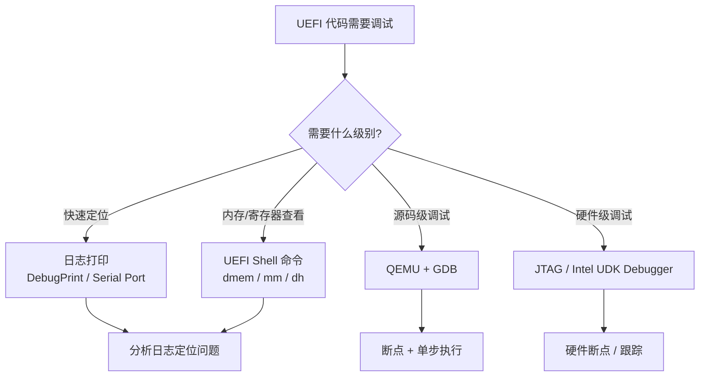

# UEFI 调试技巧与工具

## 前言

**C：** 写 UEFI 代码最怕的是什么？跑起来黑屏、卡死，啥提示都没有。别慌，这篇文章把 UEFI 调试的各种手段——从最朴素的串口打印到高大上的源码级调试——统统给你讲清楚。掌握这些技巧，你的开发效率至少翻倍。

<!-- more -->

## 调试方法总览



## 串口调试：最简单也最可靠

串口调试是 UEFI 开发中最基本、最常用的调试手段。只需要一根串口线（或 QEMU 的虚拟串口），就能把日志输出到另一台电脑上。

### 配置串口输出

在 OVMF（QEMU）中，添加串口参数：

```bash
# 启动 QEMU 并将串口重定向到终端
qemu-system-x86_64 \
    -bios OVMF.fd \
    -serial stdio \
    -debugcon stdio \
    -global isa-debugcon.iobase=0xe9
```

### 使用 DebugPrint 输出日志

EDK2 的 `DebugPrint` 是最常用的日志输出函数：

```c
#include <Library/DebugLib.h>

VOID MyFunction(VOID)
{
    // 不同错误级别
    DEBUG((EFI_D_ERROR,   "[MyDriver] This is an ERROR message: %x\n", Status));
    DEBUG((EFI_D_WARN,    "[MyDriver] This is a WARNING: value = %d\n", Value));
    DEBUG((EFI_D_INFO,    "[MyDriver] This is INFO level\n"));
    DEBUG((EFI_D_VERBOSE, "[MyDriver] Verbose debug detail\n"));

    // 带格式化输出
    DEBUG((EFI_D_INFO, "[MyDriver] Buffer at %p, size = %Lu\n", Buffer, BufferSize));
}
```

### DebugLib 日志级别

| 宏定义 | 值 | 说明 |
|--------|-----|------|
| `EFI_D_ERROR` | 0x80000000 | 错误，必须处理 |
| `EFI_D_WARN` | 0x00000002 | 警告信息 |
| `EFI_D_INFO` | 0x00000040 | 一般信息 |
| `EFI_D_VERBOSE` | 0x00400000 | 详细调试信息 |
| `EFI_D_INIT` | 0x00000005 | 初始化信息 |
| `EFI_D_BLKIO` | 0x00001000 | 块设备 I/O |

::: tip 控制日志级别
在 `.dsc` 文件中通过 `PcdDebugPrintErrorLevel` 控制输出的最低级别：
```ini
[PcdsFixedAtBuild]
  gEfiMdePkgTokenSpaceGuid.PcdDebugPrintErrorLevel|0x8000004F
```
只修改这个值就能开关不同级别的日志，不用改代码。
:::

## QEMU + GDB 源码级调试

对于更复杂的调试场景，QEMU + GDB 提供了完整的**断点、单步执行、变量查看**等能力。

### 启动 QEMU 等待 GDB 连接

```bash
# 编译 OVMF 时启用调试符号
# 在 Conf/target.txt 中设置:
#   TARGET                = DEBUG
#   TOOL_CHAIN_TAG        = GCC5

# 启动 QEMU，暂停等待 GDB 连接
qemu-system-x86_64 \
    -bios Build/OvmfX64/DEBUG_GCC5/FV/OVMF.fd \
    -s -S \
    -serial stdio
```

参数说明：
- `-s`：在 TCP 1234 端口开启 GDB 服务器
- `-S`：启动后暂停 CPU，等待 GDB 连接

### GDB 调试操作

```bash
# 启动 GDB
gdb ./Build/OvmfX64/DEBUG_GCC5/X64/MyDriver.efi

# 连接到 QEMU
(gdb) target remote :1234

# 设置源码路径（方便查看 EDK2 源码）
(gdb) directory /path/to/edk2/MdeModulePkg
(gdb) directory /path/to/edk2/MdePkg

# 设置断点
(gdb) break MyDriverEntryPoint
(gdb) break *0x7F800000

# 继续执行
(gdb) continue

# 单步执行
(gdb) next      # 跳过函数
(gdb) step      # 进入函数

# 查看寄存器和内存
(gdb) info registers
(gdb) x/16x $rsp     # 查看栈内容
(gdb) x/s 0x7F800100 # 查看字符串

# 查看调用栈
(gdb) bt
(gdb) frame 3         # 切换到第 3 层栈帧
```

### VSCode 远程调试配置

```json
// .vscode/launch.json
{
    "version": "0.2.0",
    "configurations": [
        {
            "name": "UEFI Debug (QEMU)",
            "type": "cppdbg",
            "request": "launch",
            "program": "${workspaceFolder}/Build/OvmfX64/DEBUG_GCC5/X64/MyDriver.efi",
            "miDebuggerServerAddress": "localhost:1234",
            "miDebuggerPath": "/usr/bin/gdb",
            "MIMode": "gdb",
            "setupCommands": [
                {
                    "description": "设置源码搜索路径",
                    "text": "directory /path/to/edk2",
                    "ignoreFailures": true
                }
            ]
        }
    ]
}
```

## 硬件级调试工具

### Intel UDK Debugger

Intel 提供的 UDK Debugger（UDK Debugger Tool）支持在真实硬件上进行源码级调试：

| 特性 | 说明 |
|------|------|
| USB / 串口连接 | 通过 USB 调试线或串口连接目标机器 |
| 源码级调试 | 在 Eclipse 或命令行中设置断点、单步执行 |
| 支持 JTAG | 通过 Intel DCI（Direct Connect Interface）直接调试 |
| 性能分析 | 可以进行性能追踪和热点分析 |

### JTAG 调试

JTAG 是芯片级的调试接口，能直接访问 CPU 的调试寄存器：

::: details JTAG 调试配置
- 需要 JTAG 调试探针（如 Intel ITP-XDP）
- 需要目标板支持 DCI（Direct Connect Interface）
- 通过 Intel SoC 上的调试端口连接
- 可以在 CPU 还没执行任何代码时就开始调试（Reset Vector）
- 适用于固件开发早期阶段，特别是 SEC 和 PEI 阶段的调试
:::

## OVMF：QEMU 上的虚拟固件

OVMF（Open Virtual Machine Firmware）是 EDK2 项目为虚拟机开发的 UEFI 固件，**非常适合用于开发和测试**。

### 快速搭建 OVMF 开发环境

```bash
# 1. 克隆 EDK2
git clone https://github.com/tianocore/edk2.git
cd edk2
git submodule update --init --recursive

# 2. 安装依赖（Ubuntu）
sudo apt install build-essential uuid-dev iasl nasm python3 python3-distutils

# 3. 编译 OVMF
make -C BaseTools
source edksetup.sh
build -a X64 -t GCC5 -p OvmfPkg/OvmfPkgX64.dsc

# 4. 运行
qemu-system-x86_64 \
    -bios Build/OvmfX64/DEBUG_GCC5/FV/OVMF.fd \
    -serial stdio \
    -m 2G
```

### OVMF 的优势

| 特性 | 说明 |
|------|------|
| 快速重启 | 修改代码后几秒内完成编译+测试循环 |
| 完整调试支持 | 支持 GDB、串口、QEMU Monitor |
| 无需硬件 | 只需要一台电脑就能开发 |
| 快照功能 | QEMU 支持 savevm/loadvm，快速保存/恢复状态 |
| 追踪功能 | `-trace` 参数可以追踪各种事件 |

## UEFI Shell 调试命令

UEFI Shell 提供了一组强大的诊断命令，在排查问题时非常有用：

### 常用调试命令

```shell
# 显示所有加载的协议句柄
Shell> dh
# 输出: Handle 0x00123456: ...
#        Protocol: EFI_LOADED_IMAGE_PROTOCOL
#        Protocol: EFI_DRIVER_BINDING_PROTOCOL

# 显示内存映射
Shell> dmem
# 或显示特定地址范围的内存
Shell> dmem 0x7F800000 0x100

# 读写内存（mm = memory modify）
Shell> mm 0xFED00000
# 输出: FED00000: XX XX XX XX XX XX XX XX - XXXXXXXX XXXXXXXX
# 可以直接输入新值

# 显示 PCI 设备列表
Shell> pci
# 输出: Bus Dev Func Vendor Device Command Status
#        00  00  00   8086   1237    0007    0010

# 读写 PCI 配置空间
Shell> pci 0 0 0
Shell> pci 0 0 0 4     # 读取 offset 4（命令寄存器）

# 显示加载的驱动列表
Shell> drivers
Shell> devtree          # 设备树视图

# 管理 UEFI 变量
Shell> dmpstore         # 列出所有变量
Shell> dmpstore -d Boot # 删除 Boot 变量

# 查看处理器信息
Shell> smbiosview
```

::: warning dmem 和 mm 的风险
直接读写物理内存可能导致系统崩溃。在物理机上使用时要格外小心，建议优先在 OVMF 虚拟机中操作。
:::

### dh 命令详解

`dh`（Dump Handle）是最强大的调试命令之一：

```shell
# 显示所有句柄
Shell> dh

# 按 Protocol 过滤
Shell> dh -p EFI_BLOCK_IO_PROTOCOL

# 显示特定句柄的详细信息
Shell> dh 0x00000123

# 搜索使用特定协议的句柄
Shell> dh -p gEfiDiskIoProtocolGuid
```

## 常见 UEFI 启动失败诊断

| 现象 | 可能原因 | 排查方法 |
|------|---------|---------|
| 黑屏无输出 | 显示驱动问题或显卡兼容性 | 检查 GOP 协议，用串口查看日志 |
| 卡在 DXE 阶段 | 某个 DXE 驱动加载失败 | 检查串口日志，看最后一条 DebugPrint |
| BDS 阶段无启动设备 | BootOrder 配置错误或设备驱动缺失 | UEFI Shell 中运行 `dh` 和 `devtree` |
| `EFI_NOT_FOUND` | Protocol 未安装或 GUID 不匹配 | `dh -p <ProtocolGuid>` 检查 |
| `EFI_OUT_OF_RESOURCES` | 内存分配失败 | 检查内存映射 `dmem`，看是否有泄漏 |
| Secure Boot 拒绝 | 签名不匹配 | `mokutil --sb-state` 检查，查看 db/dbx |

## 调试日志框架的最佳实践

```c
// 定义驱动专用的日志宏
#define MY_DRIVER_DEBUG(fmt, ...) \
    DEBUG((EFI_D_INFO, "[MY_DRIVER] " fmt "\n", ##__VA_ARGS__))

#define MY_DRIVER_ERROR(fmt, ...) \
    DEBUG((EFI_D_ERROR, "[MY_DRIVER][ERROR] " fmt " (Status=%r)\n", \
           ##__VA_ARGS__, Status))

// 使用示例
EFI_STATUS ProcessData(VOID *Buffer, UINTN Size)
{
    MY_DRIVER_DEBUG("Processing buffer at %p, size=%Lu", Buffer, Size);

    if (Buffer == NULL) {
        MY_DRIVER_ERROR("Buffer is NULL!");
        return EFI_INVALID_PARAMETER;
    }

    // ... 正常逻辑 ...

    MY_DRIVER_DEBUG("Processing completed successfully");
    return EFI_SUCCESS;
}
```

::: tip `%r` 格式化符
EDK2 的 DebugPrint 支持 `%r` 格式化符，它会自动将 `EFI_STATUS` 值转换为对应的错误字符串（如 `EFI_NOT_FOUND` → `"Not Found"`），非常实用。
:::

## 小结

UEFI 调试是一个分层次的体系：最简单的串口打印 + DebugPrint 能解决 80% 的问题；UEFI Shell 的 dmem/mm/dh 命令适合检查内存和协议状态；QEMU + GDB 提供源码级断点调试能力；JTAG 则用于硬件级的深度调试。推荐的开发流程是：**OVMF 上开发 → 串口日志初调 → GDB 精确调试 → 真机验证**。善用这些工具，再顽固的 bug 也能揪出来。
