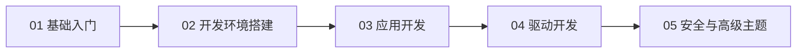

# UEFI从入门到精通

## 前言

**C：** UEFI（统一可扩展固件接口）早已取代传统 BIOS，成为现代 PC 和服务器的标准固件接口。无论你是想理解电脑启动原理、开发固件级驱动，还是折腾 Secure Boot 和网络启动，这个系列都能帮你从零搭建完整的知识体系。从 BIOS 到 UEFI 的演进讲起，一路到 EDK2 环境搭建、应用开发、驱动编写，再到安全启动与调试技巧。

<!-- more -->

## 学习路线图

## 章节导航

### 第一组：UEFI 基础入门

1. [BIOS到UEFI的演进](/courses/uefi/01-UEFI基础入门/01-BIOS到UEFI的演进)
2. [UEFI架构与启动流程](/courses/uefi/01-UEFI基础入门/02-UEFI架构与启动流程)
3. [UEFI固件与标准服务概述](/courses/uefi/01-UEFI基础入门/03-UEFI固件与标准服务概述)

### 第二组：UEFI 开发环境搭建

1. [EDK2框架介绍](/courses/uefi/02-UEFI开发环境搭建/01-EDK2框架介绍)
2. [开发环境搭建Windows与Linux](/courses/uefi/02-UEFI开发环境搭建/02-开发环境搭建Windows与Linux)
3. [第一个UEFI应用程序HelloWorld](/courses/uefi/02-UEFI开发环境搭建/03-第一个UEFI应用程序HelloWorld)

### 第三组：UEFI 应用开发

1. [协议句柄与事件机制](/courses/uefi/03-UEFI应用开发/01-协议句柄与事件机制)
2. [内存管理](/courses/uefi/03-UEFI应用开发/02-内存管理)
3. [控制台输入输出](/courses/uefi/03-UEFI应用开发/03-控制台输入输出)
4. [文件系统与存储访问](/courses/uefi/03-UEFI应用开发/04-文件系统与存储访问)

### 第四组：UEFI 驱动开发

1. [UEFI驱动模型基础](/courses/uefi/04-UEFI驱动开发/01-UEFI驱动模型基础)
2. [PCI驱动开发入门](/courses/uefi/04-UEFI驱动开发/02-PCI驱动开发入门)
3. [USB与HID协议驱动](/courses/uefi/04-UEFI驱动开发/03-USB与HID协议驱动)

### 第五组：UEFI 安全与高级主题

1. [SecureBoot安全启动](/courses/uefi/05-UEFI安全与高级主题/01-SecureBoot安全启动)
2. [UEFI变量与运行时服务](/courses/uefi/05-UEFI安全与高级主题/02-UEFI变量与运行时服务)
3. [网络协议栈与PXE启动](/courses/uefi/05-UEFI安全与高级主题/03-网络协议栈与PXE启动)
4. [UEFI调试技巧与工具](/courses/uefi/05-UEFI安全与高级主题/04-UEFI调试技巧与工具)

## 学习建议

- 从第一组开始，按顺序学习，建立 UEFI 的基本概念和启动流程认知。
- 搭建环境时优先使用 QEMU + OVMF，无需物理硬件即可验证大部分功能。
- 驱动开发部分建议先吃透 Driver Model 和 Protocol 机制，再动手写驱动。
- 调试是固件开发的核心技能，务必掌握串口调试和 QEMU+GDB 的组合。

::: tip 持续更新中

章节与示例会陆续补充；若你发现疏漏或与所用平台界面不一致之处，欢迎评论交流。

:::
