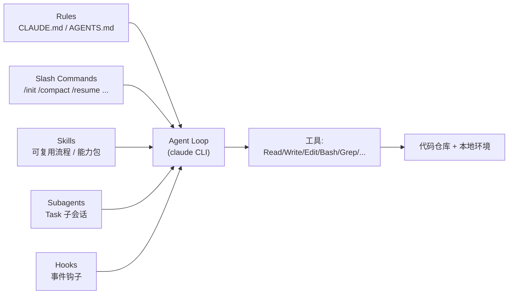

# Claude Code 是什么：定位与核心概念

## 前言

**C：** Claude Code 是 Anthropic 官方出品的**终端 AI 编码 Agent**。它不是另一个 IDE 插件，而是一个跑在你 shell 里的自主工作体：你说目标，它读代码、改文件、跑命令、跑测试，中间你随时可以叫停、review、改方向。这一篇先讲清它的定位、几个必须先搞懂的概念，以及它跟 Cursor/Copilot 不是同一个位面的竞争关系。

<!-- more -->

## 一句话定位

> **Claude Code = Claude 模型 + 代码仓库的读写能力 + 可控的自主循环**，默认跑在终端里，也能作为 SDK 嵌进你自己的工作流。

它的设计哲学是：**把模型放进仓库里，而不是把代码片段喂给模型**。差别看似微小，实际完全改变了交互方式——你不再是"复制一段 → 贴到聊天框 → 改"，而是**坐在旁边看它工作**。

## 它和常见工具的区别

| 维度 | GitHub Copilot | Cursor | Claude Code |
| -- | -- | -- | -- |
| 主战场 | IDE 内联补全 | IDE + Agent 面板 | **终端 / CI / 脚本** |
| 交互 | Tab 补全 | Chat + 应用 diff | 自主多步循环，按需确认 |
| 仓库感知 | 文件级 | 工程级 | **工程级 + 可跑命令/测试** |
| 可脚本化 | 弱 | 有限 | **原生**（`claude -p`、SDK、hooks） |
| 模型 | OpenAI 系 | 多家切换 | Claude 系（Opus/Sonnet/Haiku） |

一句话：**Cursor 是把 Agent 塞进 IDE；Claude Code 是把 Agent 塞进 shell**。选择哪个不是对错问题，而是你更愿意在哪看它工作。

## 核心概念五件套

理解了下面五个概念，读后面几篇就顺了。



- **Rules（CLAUDE.md / AGENTS.md）**：项目或目录级的长期约定，模型每次进入相应范围会自动加载，是**最便宜也最持久的提示工程**。
- **Slash 命令**：以 `/` 开头的会话指令，既有内建（`/init`、`/compact`、`/resume`、`/clear`、`/fork` 等），也可以自定义成项目/个人脚本化入口。
- **Skills**：一段"**给 Agent 看的说明书**"，让它在特定任务（比如发版、写迁移、做 review）时按固定流程来，从而把团队经验沉淀成**可复用资产**。
- **Subagents**：通过 `Task` 工具 spawn 的**隔离子会话**，有自己的上下文和工具权限，做完只把最终结果回灌给主会话，用来**并行 + 减上下文污染**。
- **Hooks**：在特定事件（如 `PreToolUse`、`PostToolUse`、`UserPromptSubmit`）触发的外部脚本，实现"**不用改 Agent 也能改 Agent 行为**"。

## 两种模式：交互 vs. Headless

Claude Code 有两种常见用法：

- **交互模式（TUI）**：直接 `claude` 进入，默认偏"对话+执行"。
- **Headless / pipeline 模式**：`claude -p "do X"` 一次性吐结果，退出码就是它怎么结束的。
  - 可以塞到 CI 里做"自动修小 lint"、"自动起 PR 描述"、"自动跑一遍 test gen"。
  - 配合 `--model`、`--output-format json`、`--resume`、`--session-id` 做可重复的工作流。

```bash
# 交互
claude

# headless（常见于脚本/CI）
claude -p "总结本次 diff 的风险点，按模块列 bullet" \
       --output-format json \
       --model sonnet
```

两种模式**共享同一套规则、技能、hooks、MCP**——学一套，哪里都能用。

## 它能做什么 / 不该让它做什么

**适合让它做**：

- 在已有仓库内做**小步、可 review** 的 PR：加测试、做 refactor、写迁移脚本。
- 把零散知识写成 skill / rule，让团队每个人**都能复用同一套最佳实践**。
- 跑**批处理类**的脏活：批量改配置、批量补 frontmatter、批量升级依赖。
- 在 CI 里做"**自动初审**"：生成 PR 描述、跑 test gen、对照规则找明显问题。

**要小心**：

- 一把 YOLO 让它改全仓库、删文件 —— 务必小步提交，用 git 做安全网。
- 让它做**没有测试覆盖**的重构 —— 它只能保证"读起来像对的"，不能保证"跑起来是对的"。
- 让它动**secrets、生产环境、线上配置** —— 默认权限收紧，别靠它"自己有分寸"。

## 心智模型：把它当一个"会写代码的实习生"

推荐的心智模型不是"**AI 魔盒**"，而是**一个愿意听话但未必懂业务的实习生**：

- 先给他 README / CLAUDE.md / 相关文件链接，**再开工**；
- 任务要**小颗粒**、目标要**可验证**（有测试最好）；
- 他做完先 review，**别急着 merge**；
- 下次遇到类似任务，把这次的经验写进 rule / skill，**免得重复教**。

这个心智模型一旦建立，后面所有工具层的细节就是"**怎么让实习生更趁手**"。

## 本章后续安排

- `02-安装、鉴权与第一次会话`：装、登、一次完整的小任务。
- `03-项目侧组织：CLAUDE.md、Slash 命令与 Skills`：把经验落到仓库里。
- `04-进阶：Subagents、Hooks、MCP 与 Plugins`：把 Agent 嵌进团队工作流。

## 小结

- Claude Code 的主战场是**终端 / 脚本 / CI**，不跟 IDE 插件抢内联补全的位置。
- 五个核心概念：**Rules、Slash、Skills、Subagents、Hooks**。
- 交互和 headless 共享同一套配置，便于从"个人玩"无缝扩展到"团队用"。
- 用它的前提是**把它当实习生而不是魔盒**，小步、可 review、有测试。

::: tip 延伸阅读

- 官方：[docs.claude.com/en/docs/claude-code](https://docs.claude.com/en/docs/claude-code)
- 下一篇：`02-安装、鉴权与第一次会话`

:::
