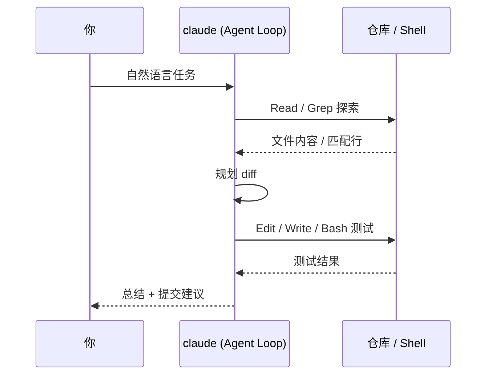

# Claude Code 安装、鉴权与第一次会话

## 前言

**C：** 这一篇目标：**15 分钟内**把 Claude Code 装好、登上、在一个真实仓库里跑完一次"小 PR 级"任务。过程里顺带讲清楚几个你迟早要碰到的概念——**权限模型、会话目录、Plan 模式、auto-accept**。

<!-- more -->

## 安装

官方推荐 npm：

```bash
npm install -g @anthropic-ai/claude-code
claude --version
```

如果不想全局污染，也可以 `npx` 直接跑；团队统一建议把版本写进 `package.json` 或 `Brewfile` / `devcontainer.json`，避免"我那台没问题"。

::: tip 运行环境要求
Node.js ≥ 18；Linux / macOS / WSL2 都行，原生 Windows 官方建议走 WSL2。`claude doctor` 可以替你把依赖检查一遍。
:::

## 鉴权

有两条常见路线：

- **Claude 订阅账号登录**：`claude /login`，浏览器里过一遍 OAuth，最省心。
- **API Key**：在 console 里建一个 key，导出 `ANTHROPIC_API_KEY` 环境变量。

两条路各有适用场景：

| 场景 | 建议方式 |
| -- | -- |
| 个人日常开发 | `claude /login`（用套餐内额度） |
| CI / headless / 容器 | `ANTHROPIC_API_KEY` 环境变量 |
| 公司网关 / 第三方路由 | 走 `ANTHROPIC_BASE_URL` 指向网关 |

多账号切换用 `claude /login` 进去切；想清空凭据用 `claude /logout`。

## 第一次会话：在一个真实仓库里走一遍

挑一个你熟悉的仓库（**建议一个已经干净 commit 过的分支**），然后：

```bash
cd your-repo
claude
```

进入 TUI 后，推荐先让它自己"看一眼"：

```text
> /init
```

`/init` 做两件事：

1. 扫一遍仓库结构、README、常见配置文件；
2. 在仓库根**生成一份 CLAUDE.md**，记录它理解的项目约定、常用命令、测试指令等。

这份 CLAUDE.md 是后续所有会话的"**记忆锚点**"，以后每次打开都会被自动读取。下一篇会细讲怎么维护它。

然后给一个**小颗粒、可验证**的任务，比如：

```text
> 给 src/utils/date.ts 里的 `formatDate` 函数加一组单元测试，覆盖 UTC、时区偏移、null 入参三种情况；用现有的 vitest 配置；不要改业务代码。
```

观察它的工作节奏：

- 会先 `Read` 目标文件；
- 可能 `Grep` 一下看已有测试位置；
- 用 `Edit` / `Write` 产出测试文件；
- 用 `Bash` 跑 `pnpm test`；
- 失败就改，改到绿为止；
- 最后给你一段 summary。



## 权限模型：别一上来就 YOLO

Claude Code 对每个**可能改变世界的动作**（写文件、跑命令、联网）都会问你一次。模式有三档：

| 模式 | 触发 | 适用 |
| -- | -- | -- |
| Ask（默认） | 每步确认 | 陌生仓库 / 高风险操作 |
| Accept Edits | `Shift+Tab` 或 `/accept-edits` | 信任它改自己项目里某些目录 |
| YOLO | `--dangerously-skip-permissions` | 一次性临时任务、容器沙箱 |

常见做法：**主分支上 Ask**，专门的 sandbox 目录开 Accept Edits，**容器/一次性脚本**才上 YOLO。**不要在有 secrets、生产配置、跨仓库脚本的宿主机直接 YOLO**。

## Plan 模式：先想清楚再动

按 `Shift+Tab` 可以在 **Plan / Agent / Auto** 几个模式间切换。Plan 模式下：

- Agent **只读不写**，专门梳理思路、给方案；
- 你 review 完方案，再切回 Agent 模式执行。

对"**不确定会改多少文件**"的任务，强烈建议先 Plan 一轮。这跟 vibe-coding 分册引言里强调的"**小 diff + 人工 review**"是一套思路。

## 会话管理：compact / resume / fork / clear

几条 slash 命令你会每天都用：

```text
/compact     把当前上下文摘要化，腾出 token
/clear       直接清空当前会话（不删历史）
/resume      从历史里选一个会话继续
/fork        复制当前会话另起分支，试错不污染主线
/status      看当前模型、目录、权限、token 用量
```

长任务里 `/compact` 的时机很关键：**发现模型开始"忘事"就压缩一次**；不要等它彻底飘了再救。

## headless 一瞥

把同样能力放进脚本：

```bash
claude -p "读 CHANGELOG.md，整理成 release-notes 给 v2.0" \
       --output-format json \
       --model sonnet \
       > notes.json
```

常见用途：

- PR 自动写描述（结合 `gh pr view` 喂 diff）。
- CI 里做"**自动 lint 修小问题**"，失败打回。
- 批处理：遍历 100 个文件挨个做同一件事，比交互模式省时间。

## 常见坑

- **把 `node_modules` / `.git` / 大数据文件放进上下文**：用 `.gitignore` + 项目 rule 里显式告诉它别读。
- **同时开两个 claude 进程改同一目录**：git 会打架，用 `/fork` 或 worktree 隔离。
- **`/compact` 太晚**：上下文被塞满后，它会开始 hallucinate，该压就压。
- **依赖 `--dangerously-skip-permissions` 过活**：这是应急，不是日常。

## 小结

- `npm i -g` 装好，`claude /login` 或 API Key 登上。
- 第一次先 `/init` 生成 CLAUDE.md，小颗粒任务练手。
- 熟悉三档权限、Plan 模式、`/compact`、`/fork`，日常就稳了。
- Headless 模式是从"个人玩"升级到"团队工作流"的钥匙。

::: tip 延伸阅读

- `claude --help`、`claude doctor`
- 下一篇：`03-项目侧组织：CLAUDE.md、Slash 命令与 Skills`

:::
