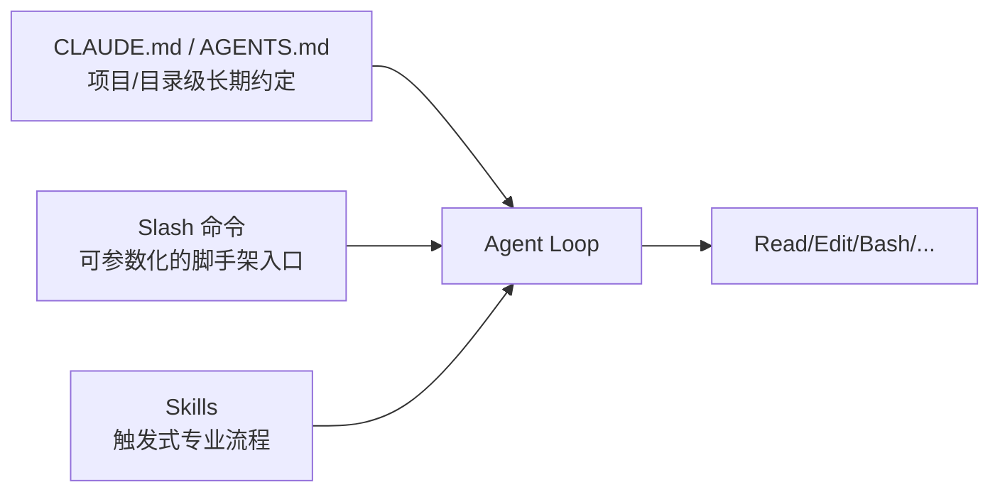

# Claude Code 项目侧组织：CLAUDE.md、Slash 命令与 Skills

## 前言

**C：** Claude Code 一装完就能用，但**"能用"和"好用"差了一条仓库级组织**。这一篇讲三块：怎么写一份活的 CLAUDE.md、怎么把重复指令沉淀成 slash 命令、怎么把团队经验做成 skills 让 Agent 自动复用。核心目标只有一个——**同一件事，最多教它一次**。

<!-- more -->

## 分层心智：rules / commands / skills 各管一段



- **Rules** 解决"我每次都要告诉它一遍的事"——**自动挂载**。
- **Slash 命令**解决"某个操作我每天都要做 5 次"——**主动调用**。
- **Skills** 解决"某种任务有固定最佳实践"——**命中触发**（Agent 自己判断要不要用）。

三层是互补关系，不是替代。

## CLAUDE.md：仓库的"使用说明书"

### 位置与作用域

- 仓库根 `CLAUDE.md`：全仓生效。
- 子目录 `CLAUDE.md`：进入该子目录工作时**叠加生效**（越深越具体）。
- 用户级 `~/.claude/CLAUDE.md`：个人跨项目习惯（比如"输出中文"、"默认用 pnpm"）。
- 同义：`AGENTS.md` 也被识别，方便和其它 Agent 工具共用。

### 写什么

少写"你要温柔对我"之类的废话，多写**能让它少猜、少错**的硬信息：

```markdown
# Project: easyzoom.github.io

- 包管理：`pnpm`，别用 `npm`
- 启动：`pnpm dev`；构建：`pnpm build`
- 文章位置：`docs/courses/**/*.md`，frontmatter 必含 `title/author/date/categories/tags`
- 代码风格：优先小 diff、小步提交，不要大段重排
- 禁止：直接改 `pnpm-lock.yaml` 之外的锁文件
- Review：所有修改先跑 `pnpm lint && pnpm test`，再提交
```

几个**高价值段落**建议每个仓库都有：

- **必跑命令**：启动、构建、测试、lint、typecheck 各一行。
- **目录约定**：哪些目录是什么、什么东西不要动。
- **代码风格**：关键几条就够，不要抄整本规范。
- **禁止清单**：明确"**别做什么**"比"**要做什么**"更好使。

### 让它自己维护 CLAUDE.md

真正的诀窍：**把 CLAUDE.md 当成一份活文档，每次踩坑就让它更新**。

```text
> 你刚才在 docs 下误删了一个 index.md；把"不要删除已有 index.md"这条规则追加到 CLAUDE.md 的禁止清单。
```

它会自己打开文件、追加一行、提交——下一次不会再犯同一个错。这是 **compound engineering** 思路在 vibe-coding 里的基本动作。

## Slash 命令：把常用操作做成快捷方式

### 内建必会

| 命令 | 用途 |
| -- | -- |
| `/init` | 首次进仓库，生成 CLAUDE.md |
| `/compact` | 压缩上下文 |
| `/clear` | 清空当前会话（历史仍在） |
| `/resume` | 从历史里选一段继续 |
| `/fork` | 会话分叉，试错不污染主线 |
| `/review` | 对当前 diff 做 review |
| `/status` | 看模型、token、权限 |
| `/login` / `/logout` | 账户切换 |

### 自定义命令

项目级放 `.claude/commands/<name>.md`，用户级放 `~/.claude/commands/<name>.md`。文件本身就是一段"被 Agent 读到的提示 + 指令模板"，例如：

```markdown
---
description: 基于当前 diff 生成 PR 描述
---

请基于 `git diff origin/main...HEAD` 的内容：

1. 用 3~5 个 bullet 说明**为什么**这次要改（先 why，再 what）
2. 列出**测试计划**（命令 + 预期）
3. 列出**潜在风险**

输出 Markdown，不要加前后多余的寒暄。
```

保存为 `.claude/commands/pr-desc.md` 后，在会话里打：

```text
/pr-desc
```

就会按这套模板跑。参数化也支持：

```markdown
---
description: 给指定文件补单元测试
argument-hint: "<file>"
---

请为 $ARGUMENTS 增加单元测试，沿用现有 vitest 配置……
```

```text
/add-tests src/utils/date.ts
```

::: tip 命令和 skill 的分界
**主动调 → slash 命令**；**任务到了自动该用 → skill**。同一份经验，两种触发方式可以并存。
:::

## Skills：给 Agent 的"能力包"

Skill 是一个目录，至少含一个 `SKILL.md`：

```text
.claude/skills/release-notes/
├── SKILL.md            # 触发条件 + 执行流程
├── template.md         # 输出模板
└── scripts/            # 可选：辅助脚本
    └── collect.sh
```

`SKILL.md` 的 frontmatter 决定它**什么时候被 Agent 考虑使用**：

```markdown
---
name: release-notes
description: 用标准格式起草一版本的 release notes。当用户提到 "发版"、"release notes"、"changelog" 时考虑使用。
---

# Release Notes Skill

## 触发
用户要求整理/起草 release notes，或要发版。

## 步骤
1. `bash scripts/collect.sh <from_tag> <to_tag>` 收集提交
2. 按 `template.md` 填模板
3. 分类：feat / fix / perf / chore，去重
4. 输出到 `RELEASE_NOTES.md`，给用户 review
```

### skill 与 rule / slash 的差异

| 维度 | Rule (CLAUDE.md) | Slash 命令 | Skill |
| -- | -- | -- | -- |
| 触发 | **每次会话自动** | 你主动 `/xxx` | **Agent 判断是否用** |
| 体量 | 精简约定 | 单一流程 | **完整作业 SOP** |
| 适合 | "别做 X / 必做 Y" | "执行一次 X" | "一类任务怎么干" |

一个成熟的项目往往三者并存：rule 管底线，slash 管日常动作，skill 管复杂 SOP。

### skill 的两条黄金守则

- **description 要写清触发关键词**：Agent 就是靠这一段决定要不要加载你这 skill。
- **把决策点显式列出来**：如"若发现 X，则问用户 Y"比"你自己看着办"靠谱一个量级。

## 三者协作的一个小范例

仓库是一个 VitePress 博客：

- `CLAUDE.md`：写清"包管理 pnpm、文章位置、frontmatter 必含字段、禁止直接动主题源码"。
- `.claude/commands/new-post.md`：参数化命令，一行起稿："用给定标题新建一篇 course 文章，frontmatter 自动补齐"。
- `.claude/skills/course-series-writer/SKILL.md`：触发于"**写一个系列**"；流程是先确认主题 → 拆章节 → 依次起稿 → 每篇对齐既有风格 → 最后校对链接。

从此你只管说"**写一个 Claude Code 入门系列**"，后面的事按 skill 走，你只负责 review。

## 小结

- CLAUDE.md 是仓库的"活说明书"，**踩坑就更新**，越用越好用。
- Slash 命令把"**我主动要做的重复动作**"脚本化。
- Skills 把"**某类任务的最佳实践**"沉淀成 Agent 可自动复用的 SOP。
- 三者分别管"**底线 / 日常动作 / 复杂作业**"，组合起来才是团队级的生产力。

::: tip 延伸阅读

- 官方：Claude Code *Memory* / *Slash commands* / *Skills* 文档
- 下一篇：`04-进阶：Subagents、Hooks、MCP 与 Plugins`

:::
