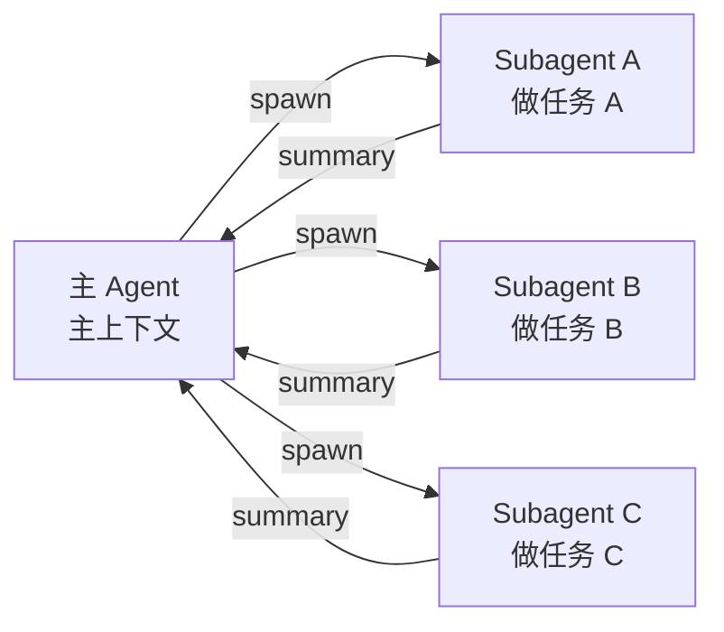
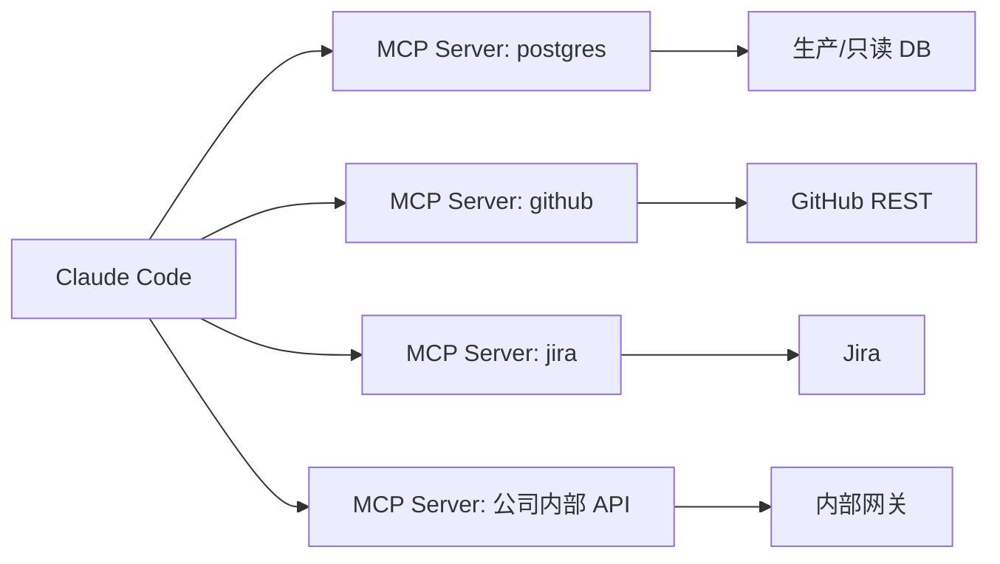
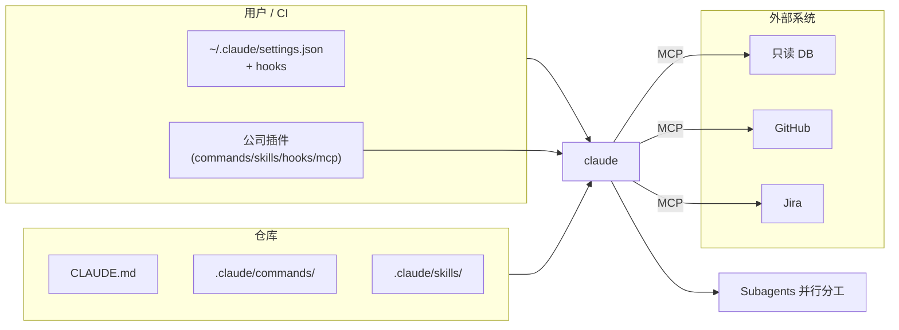

# Claude Code 进阶：Subagents、Hooks、MCP 与 Plugins

## 前言

**C：** 前面三篇把"一个人用"讲透了，这一篇讲"**怎么把它嵌进团队工作流**"。四件武器：**Subagents** 做并行/降上下文污染，**Hooks** 做事件钩子，**MCP** 对外扩能力，**Plugins** 把前面所有东西打包分发。

<!-- more -->

## Subagents：一个会话里开多个"分身"

主 Agent 通过 `Task` 工具可以 **spawn 子 Agent**。子 Agent 有自己独立的上下文与工具权限，**只把最终结果回给主会话**，所以它解决两件事：

- **并行**：10 个独立子任务同时跑，远快于串行。
- **降污染**：中间探索过程（大量 Read / Grep 输出）**不进主上下文**，主 Agent 继续保持清醒。



### 什么时候用

- **扩探索**：读 100 个文件、搜 50 个关键词这类脏活，一个 Subagent 就扛掉，主 Agent 只拿结论。
- **多方案并行**：让三个 Subagent 各按不同思路改同一个模块，你在主会话里挑最好的（"**best-of-N**"）。
- **专业化分工**：一个 Subagent 专门做 review、一个专门做 doc、一个专门改实现。

### 注意事项

- 子 Agent 不见主会话的历史，**任务描述必须自包含**：给清目标、文件路径、验收标准。
- 子 Agent 消耗的 token 进总账，**并行越多越贵**；给任务预算边界比全放开更稳。
- 子 Agent 内部再 spawn 子 Agent 容易失控，**除非真的需要，一层为宜**。

## Hooks：不改 Agent，改 Agent 的行为

Hooks 是在特定事件点**调用外部脚本**的机制。常见事件：

| 事件 | 触发时机 | 典型用途 |
| -- | -- | -- |
| `UserPromptSubmit` | 每次用户输入前 | 注入上下文、隐私过滤、关键词拦截 |
| `PreToolUse` | 某工具调用前 | 白名单审查、参数改写 |
| `PostToolUse` | 某工具调用后 | 自动 lint、格式化、安全扫描 |
| `Stop` / `SessionEnd` | 会话结束时 | 写审计日志、落地总结 |
| `Notification` | Agent 需要用户确认时 | 推送到 IM / 通知中心 |

### 配置位置

`~/.claude/settings.json` 或项目级 `.claude/settings.json`：

```json
{
  "hooks": {
    "PostToolUse": [
      {
        "matcher": "Edit|Write",
        "hooks": [
          { "type": "command",
            "command": "pnpm prettier --write \"$CLAUDE_FILE_PATHS\" || true" }
        ]
      }
    ],
    "PreToolUse": [
      {
        "matcher": "Bash",
        "hooks": [
          { "type": "command",
            "command": ".claude/hooks/bash-guard.sh" }
        ]
      }
    ]
  }
}
```

脚本通过 stdin 读 JSON，通过 **退出码 / stdout** 影响后续行为（`0` 放行、非 0 阻断）。

### 几个常见用法

- **PostToolUse → prettier/eslint --fix**：它改的代码天然符合项目规范。
- **PreToolUse(Bash) → 危险命令黑名单**：拦截 `rm -rf /`、`curl ... | sh` 之类。
- **UserPromptSubmit → 注入最新 `git log`**：把"本会话之前的提交"自动喂进上下文。
- **Stop → 把本轮改动推到一个 audit 日志**：合规要求场景下很有用。

::: warning 别把 hook 写成 Agent 黑盒
hook 出错会直接影响 Agent 可用性；脚本要有超时、有日志、失败可降级——别写"正常跑不出问题"的脚本。
:::

## MCP：把外部系统接成可用工具

**MCP (Model Context Protocol)** 是一套开放协议：任何实现了 MCP server 的系统，都能以**工具 / 资源 / 提示**的形式挂进 Claude Code。



### 配置

`~/.claude.json` 或项目级 `.mcp.json`：

```json
{
  "mcpServers": {
    "postgres": {
      "command": "npx",
      "args": ["-y", "@modelcontextprotocol/server-postgres",
               "postgres://readonly@db.internal/app"]
    },
    "github": {
      "command": "npx",
      "args": ["-y", "@modelcontextprotocol/server-github"],
      "env": { "GITHUB_TOKEN": "${GITHUB_TOKEN}" }
    }
  }
}
```

加载后：

- `claude /mcp` 可以看到所有服务和它们暴露的工具/资源。
- Agent 在需要时自动调用 `postgres.query` / `github.create_issue` 等。

### 典型接入清单

| 领域 | 接入效果 |
| -- | -- |
| 数据库（只读） | Agent 能帮你写 SQL、查数、做数据分析 |
| GitHub / GitLab | 建 issue、起 PR、拉 review 评论 |
| Jira / Linear | 查 ticket、标状态、起子任务 |
| Sentry / Datadog | 查错误、看指标 |
| 内部知识库 | 查文档、搜 wiki |
| 浏览器 | 做 UI 级端到端测试 |

**建议只接只读 / 低风险的**；写操作一定要配合 hook 的 `PreToolUse` 审批。

## Plugins：把所有东西打包分发

Plugins 是把 **commands + skills + hooks + MCP 配置**打包成一个可安装单位，解决"**团队里每个人都要手动装一遍**"的问题。

### 结构

```text
my-plugin/
├── plugin.json         # 元信息 + 入口声明
├── commands/
│   └── pr-desc.md
├── skills/
│   └── release-notes/
│       └── SKILL.md
├── hooks/
│   └── settings.json   # hook 配置
└── .mcp.json           # 插件自带的 MCP server
```

装起来一行：

```bash
claude plugin install git@github.com:your-team/claude-plugin-xxx.git
```

装完后，这份插件带的 slash 命令 / skills / hooks / MCP 都会**自动挂载**。适合把公司里那些"**所有仓库都该有的规矩**"抽出来，一处维护、处处生效。

### 应用场景

- **团队最佳实践包**：统一 review、统一 PR 描述、统一 release 流程。
- **领域专长包**：嵌入式、前端、数据、安全各行各业不同侧重。
- **合规 / 审计包**：hook 审计 + 禁用工具白名单，交付给受监管团队使用。

## 组合起来的一张典型图

一个中型团队的 Claude Code 生态：



你可以逐层落地：先 CLAUDE.md → 再 slash 命令 → 再 skills → 再 hooks → 再 MCP → 最后 plugin。**一口吃成胖子反而没人用**。

## 小结

- **Subagents** 解决并行和上下文污染，任务描述必须自包含。
- **Hooks** 让你不改 Agent 也能改它的行为，适合 lint/审计/拦截。
- **MCP** 把外部系统按"工具/资源/提示"接进来，优先上只读低风险服务。
- **Plugins** 把 commands + skills + hooks + MCP 打包分发，是团队规模化的落点。
- 组合策略是"**从小到大、先约定再扩展**"，一层一层加。

::: tip 延伸阅读

- 官方：Claude Code *Subagents* / *Hooks* / *MCP* / *Plugins* 文档
- 本分册规划：后续会有 Cursor / Codex CLI / Windsurf 等横向对比

:::
