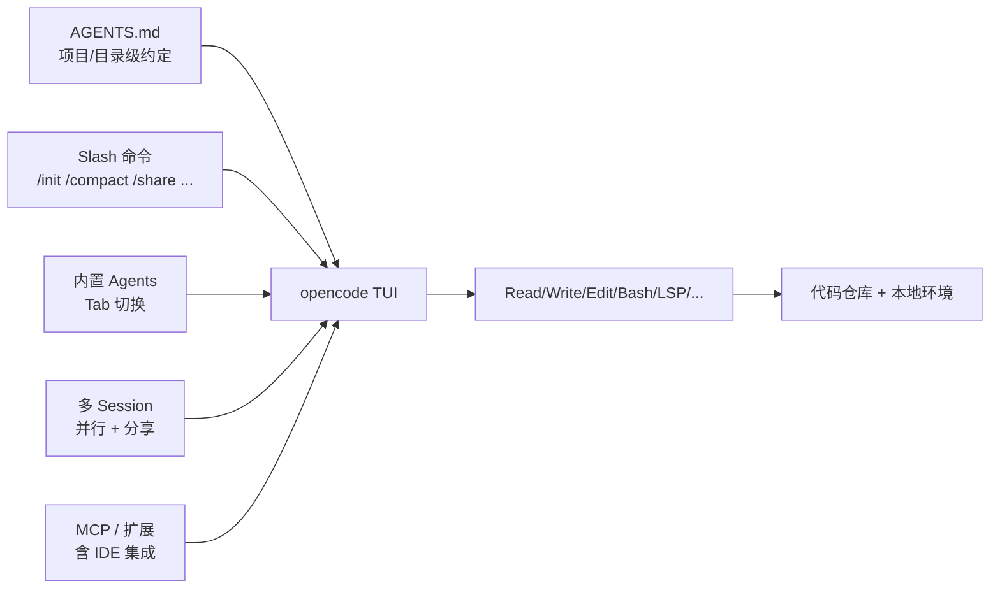

# OpenCode 是什么：定位与与 Claude Code 的对比

## 前言

**C：** OpenCode 是 SST 团队（terminal.shop 的作者们）做的**开源终端 AI 编码 Agent**，TypeScript 写的，2025-04 开源，到 2026-04 已经 14.7 万星、v1.14.x。能力上跟 Claude Code 非常接近，但在**不绑厂商、TUI 手感、多 session、Web 可分享**几件事上明显不同。这一篇讲清它是什么、适合什么、和 Claude Code 怎么选。

<!-- more -->

## 一句话定位

> **OpenCode = Claude Code 的开源平替**，原生 TUI，任意 LLM 提供方，MIT License。

再展开一点：它不想赌一家模型厂商的未来，所以把"**模型选择 / 账号计费 / 部署形态**"全部做成可插拔；默认推荐自家的 OpenCode Zen 路由，但你完全可以只用自己账号的 Claude / GPT / Gemini / 本地 Ollama 跑。

## 几件能让你立刻理解它的事实

- 仓库：`sst/opencode`（现为 `anomalyco/opencode`），TypeScript、MIT。
- 安装：`curl -fsSL https://opencode.ai/install | bash`，或 `brew install anomalyco/tap/opencode`、`npm i -g opencode-ai`。
- 入口：`opencode` 进入 TUI；`/init` 生成 `AGENTS.md`。
- 模型：通过 [Models.dev](https://models.dev) 接入 **75+ 提供方**，含 Claude / GPT / Gemini / 本地。
- 多 session：同一项目可以**同时开多个 Agent**，互不干扰。
- 分享链接：任一 session 都能生成**可访问的 Web 链接**，方便协作/debug。
- Desktop App（Beta）+ IDE 扩展（VS Code / Cursor / Zed / Windsurf / VSCodium）。

## 它和 Claude Code 的区别

官方 FAQ 里就有一句原话："**非常接近 Claude Code 的能力**，但——"：

| 维度 | Claude Code | OpenCode |
| -- | -- | -- |
| 厂商耦合 | Anthropic 自家 | **不耦合**，任意 OpenAI 兼容 + 自家 Zen 路由 |
| 模型面 | Claude 系为主 | **75+ 提供方**（Models.dev） |
| UI 侧重 | TUI 稳扎稳打 | **原生 TUI**，neovim 用户品味 |
| 多 session | 通过 `/fork` 等 | **原生并行多 session** |
| 分享 | 会话本地 | **可生成公开分享链接** |
| 桌面/IDE | CLI 为主 | **桌面 App + 多 IDE 扩展** |
| License | 闭源商业 | **MIT** |
| 项目约定 | `CLAUDE.md` | **`AGENTS.md`**（与 Claude Code 也兼容） |

一个简单的选法：

- **只用 Claude、想要官方兜底** → Claude Code。
- **想在同一个项目里用不同模型，或想拥抱开源** → OpenCode。
- **团队里既有 Claude 订阅又想试别家** → OpenCode 直接帮你省一层钱。

::: tip 不是零和博弈
`AGENTS.md` 本身是两家都认的"共识文件"。你可以**同一个仓库里 Claude Code / OpenCode 并用**——团队谁熟悉哪个就用哪个，规则（rules）共享同一份。
:::

## 它的"核心五件套"

和 Claude Code 的心智模型完全能对上号：

- **AGENTS.md**：项目级长期约定，和 `CLAUDE.md` 同源；上一册讲过的"rules"概念。
- **Slash 命令**：`/init`、`/compact`、`/share`、`/models`、`/agents` 等；可自定义。
- **内置 Agents**：两种，`Tab` 切换——一个偏"**对话规划**"，一个偏"**执行动手**"；后面篇目细讲。
- **多 Session**：同一个项目并行开多条线，走不同思路互不干扰。
- **MCP / 扩展**：跟 Claude Code 一样是一等公民，再加桌面 / IDE 里的集成点。

## 亮点机制：LSP 自动加载

这件事让"**坐在 neovim 用户品味里**"真的落地：

- 打开一个仓库，OpenCode 会根据文件类型**自动启动合适的 LSP**（tsserver / rust-analyzer / pyright / gopls 等）。
- Agent 调用"**跳转定义 / 找引用 / 类型检查**"时走 LSP，而不是盲读文件。
- 结果：改跨文件 refactor 时**比纯 grep/read 稳很多**，幻觉率更低。

对照之下，Claude Code 依靠模型自己"顺着读"的成分更多；OpenCode 的 LSP 路线在**大型静态类型项目**里体感明显更稳。

## 适合 / 不适合

**适合**：

- 想一个终端同时挂 2~3 个思路**跑并行实验**（A/B 改法）。
- 多语言项目，尤其**静态类型重**：TS/Rust/Go/Kotlin 等，LSP 真能帮它少犯错。
- 团队里**多模型混用**：有人用 Claude、有人用 GPT、有人跑本地，需要统一工具面。
- 要把会话**分享给 reviewer**，用共享链接省掉截图/复制粘贴。

**不适合**：

- 只想要"**极简一条 CLI + Claude**"、连 AGENTS.md 都嫌多 → Claude Code 的默认更对味。
- 完全离线且**只有** CPU 的老机器 → TUI 自身不重，但配合大模型推理总归得网络或 GPU。

## 心智模型：跟 Claude Code 同一套

vibe-coding 分册引言里说过：**模型是"愿意听话的实习生"**。OpenCode 的差别不在于这个心智模型，而在于——

- **你可以换实习生**：今天用 Claude，明天用 GPT，随 `/models` 切；
- **你可以同时雇两个**：多 session 并行，谁干得好用谁的；
- **实习生有 LSP 当字典**：不容易瞎编。

理解了这一层，后面几篇就是"**怎么把这个实习生用起来**"的实操。

## 本章后续安排

- `02-安装、auth 与第一次会话`：三条安装路径 + `opencode auth login` + 一次真实任务。
- `03-项目侧组织：AGENTS.md、Slash 命令与内置 Agents`：怎么把约定和常用动作落到仓库里。
- `04-进阶：多 session、LSP、MCP 与 IDE / 桌面扩展`：把 OpenCode 嵌进团队工作流。

## 小结

- OpenCode = **开源、不绑厂商、原生 TUI 的 Claude Code 替代**。
- 核心概念和 Claude Code 可一一对位，`AGENTS.md` 天然共享，两家可**并用**。
- 差异化优势：**多模型、多 session、LSP 自动加载、可分享、桌面 + IDE 扩展齐全**。
- 选它还是 Claude Code，主要看你是**"只用 Claude" 还是 "想多家都试"**。

::: tip 延伸阅读

- 官方站：[opencode.ai](https://opencode.ai) / 文档：[opencode.ai/docs](https://opencode.ai/docs)
- 仓库：[anomalyco/opencode](https://github.com/anomalyco/opencode)
- 下一篇：`02-安装、auth 与第一次会话`

:::
