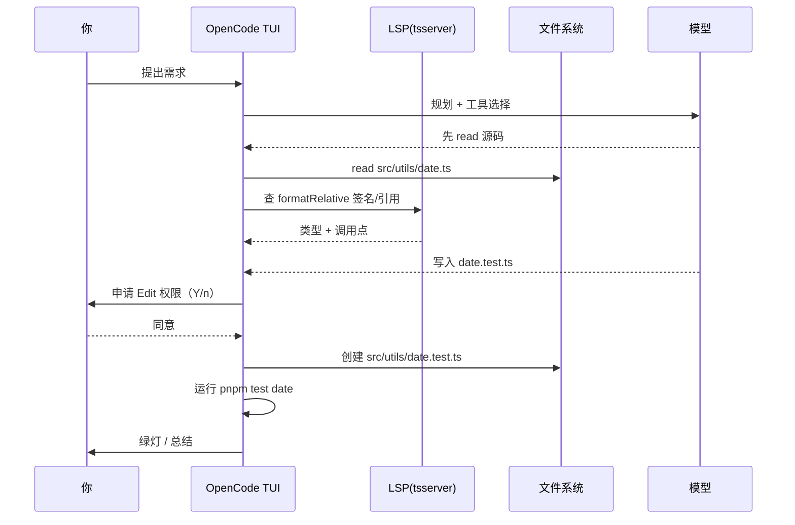

# 安装、auth 与第一次会话

## 前言

**C：** 这一篇把 OpenCode 从 0 跑到 1：装上、登一家模型、打开一个项目、完成一次真实修改。目标是你看完能立刻照着跑，不用再翻官方文档。

<!-- more -->

## 一、前置准备

官方对终端是有一点要求的（TUI 用了 Unicode + 鼠标 + 真彩色）：

- **现代终端**：WezTerm、Alacritty、Ghostty、Kitty 任一；macOS 自带 Terminal、Windows Terminal、iTerm2 也行。
- **Node 18+** 或 **Bun**（仅走 npm/bun 安装路径时需要）。
- **至少一家 LLM 的账号或 API Key**（推荐 Claude Pro/Max，成本最划算；也可 OpenAI / Gemini / DeepSeek / 本地 Ollama）。

## 二、三条安装路径

挑一条即可：

### 1. 官方一键脚本（最快）

```bash
curl -fsSL https://opencode.ai/install | bash
```

装到 `~/.opencode/bin`，自动加 PATH。升级：

```bash
opencode upgrade
```

### 2. Homebrew（macOS / Linux，推荐）

```bash
brew install anomalyco/tap/opencode
```

好处：随 `brew update && brew upgrade` 一起滚，不用额外管。

### 3. npm / Bun（已有 Node 技术栈时方便）

```bash
npm i -g opencode-ai@latest
# 或
bun add -g opencode-ai
```

Windows 最稳的是 `scoop install opencode`，或直接从 Release 下二进制。

::: tip 旧版本清理
官方提醒：**移除 0.1.x 之前的旧版本**再装新版，否则残留配置会干扰。
:::

装完验一下：

```bash
opencode --version
# v1.14.x
```

## 三、登一家模型：`opencode auth login`

OpenCode 自己不托管你的密钥，全部走**本地 keychain**。首次跑：

```bash
opencode auth login
```

会弹一个交互菜单，挑 provider：

```text
┌  Add credential
│
◆  Select provider
│  ● Anthropic (recommended)
│  ○ OpenAI
│  ○ Google
│  ○ Amazon Bedrock
│  ○ Azure
│  ○ DeepSeek
│  ○ Groq
│  ...
└
```

几种典型选法：

- **Claude Pro / Max 订阅**：选 Anthropic → 浏览器 OAuth 登录，**共用订阅额度**，性价比最高。
- **只有 API Key**：选对应 provider，粘贴 `sk-...`。
- **本地 Ollama**：选 Ollama，填 endpoint（默认 `http://localhost:11434`）。
- **多家混用**：重复 `opencode auth login` 多次，每家都登。

登完可以列一下：

```bash
opencode auth list
# anthropic  (oauth)
# openai     (api-key, sk-...abcd)
# ollama     (http://localhost:11434)
```

## 四、第一次会话：跑一个真实小任务

切到任意项目目录，启动 TUI：

```bash
cd /path/to/your/project
opencode
```

第一次进来先**让它认识项目**：

```text
> /init
```

OpenCode 会读一遍仓库，生成一份 `AGENTS.md`——这正是上一篇说的"项目级约定"文件。之后每次会话都会自动读它。

接下来给一个小任务试水，比如"**为 utils/date.ts 补单元测试**"：

```text
> 给 src/utils/date.ts 的 formatRelative 函数补 Vitest 单元测试，
  覆盖：今天、昨天、更早、未来日期四种情况。
```

你会看到 TUI 里一步步发生的事：



关键点：

- **每次写入都会问你**（除非切到 YOLO）；
- 写入前会先**读 + 过 LSP**，比 Claude Code 对类型更敏感；
- 跑完测试会把命令和结果贴回对话里，可审计。

## 五、权限模型：和 Claude Code 对齐

进 TUI 后右下角能看到当前权限档位，一共三档：

| 档位 | 含义 | 适合 |
| -- | -- | -- |
| **Ask** | 每次 Edit/Bash 都问 | 首次跑、不熟的仓库 |
| **Accept Edits** | 文件写入直接放行，shell 还是问 | 熟悉的项目，节奏快 |
| **YOLO** | 全放行 | **只在容器 / 沙箱里用** |

切换：`/permissions`，或启动加参数：`opencode --permission yolo`。

::: warning 把 YOLO 关在盒子里
OpenCode 会一次性跑 `rm -rf`、`git push -f`、`npm publish` 这类命令。**YOLO 只在 Docker / Devcontainer / 远程沙箱里用**，不要直接在你本机 `$HOME` 里开。
:::

## 六、常用快捷命令速查

TUI 里打 `/` 会弹出 Slash 菜单。高频用的：

| 命令 | 作用 |
| -- | -- |
| `/init` | 生成/刷新 `AGENTS.md` |
| `/models` | 切当前 session 的模型 |
| `/agents` | 切内置 Agent（对话 / 执行）也可 Tab |
| `/session new` | 新开一个 session（并行用） |
| `/compact` | 压缩上下文，释放 token |
| `/share` | 生成可访问的会话分享链接 |
| `/permissions` | 切 Ask / Accept Edits / YOLO |
| `/help` | 查所有命令 |
| `Ctrl+C` / `q` | 退出 |

## 七、Headless / 脚本化：不止 TUI

想在 CI、Makefile、批处理里用 OpenCode？直接把问题当参数：

```bash
opencode run "修复 eslint 报出的所有 no-unused-vars，跑通 pnpm lint"
```

或喂 stdin 管道：

```bash
git diff HEAD~1 | opencode run "解释这段 diff，指出潜在破坏性变更"
```

`opencode run` 会**一次性执行完退出**，适合：

- **pre-commit** 里做轻量审阅；
- CI 里做 lint/typo 批改；
- 通过 cron 定期跑"整理 inbox / 清 dead code"。

## 八、小结

- 三条路：**install 脚本 / brew / npm**，任选其一；装完 `opencode --version` 验证。
- `opencode auth login` 可以**加多家**，Claude Pro/Max 订阅最划算。
- 进项目先 `/init` 生成 `AGENTS.md`，再给一个真任务试水。
- 权限三档**和 Claude Code 对齐**，YOLO 务必在沙箱里跑。
- 除 TUI 外还有 `opencode run` 的 **Headless 模式**，适合 CI / pipeline。

::: tip 延伸阅读

- 安装文档：[opencode.ai/docs/install](https://opencode.ai/docs/install)
- Providers 列表：[models.dev](https://models.dev)
- 下一篇：`03-项目侧组织：AGENTS.md、Slash 命令与内置 Agents`

:::
