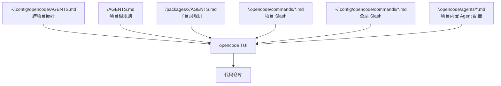
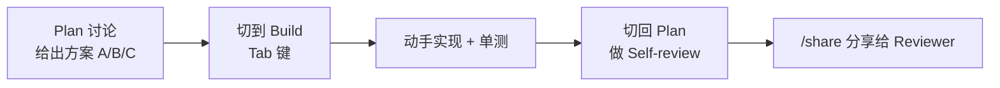
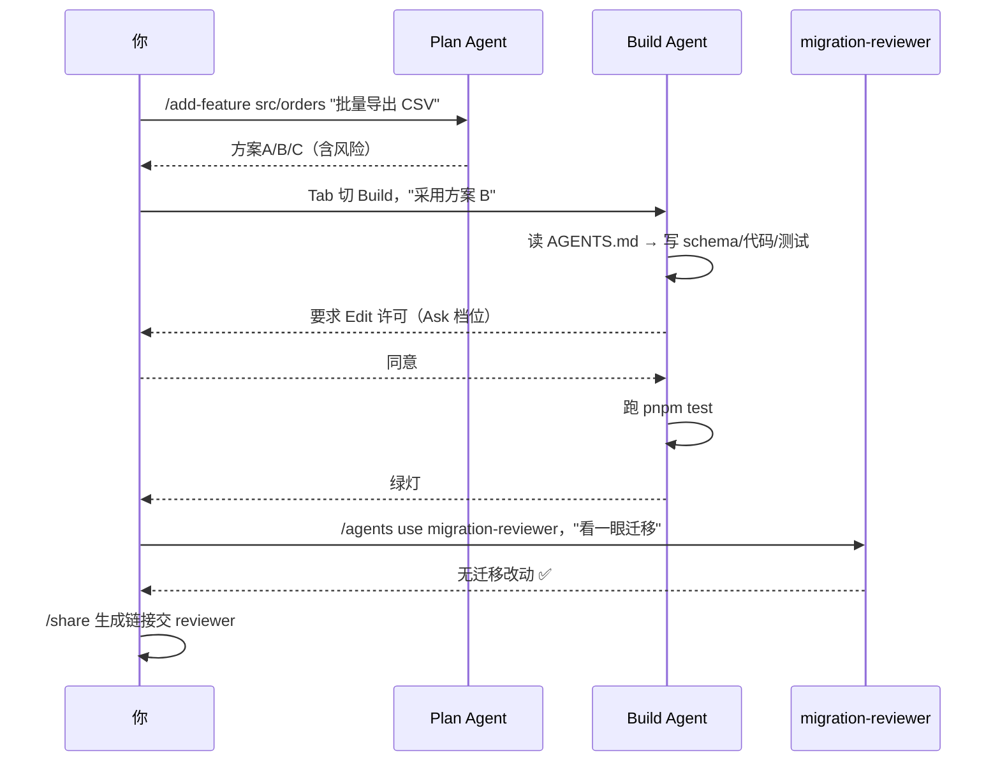

# 项目侧组织：AGENTS.md、Slash 命令与内置 Agents

## 前言

**C：** OpenCode 和 Claude Code 同样走"**项目自带说明书**"的路线，但它把这份说明书命名为社区共识文件 **`AGENTS.md`**；Slash 命令系统相似；另外多一件东西——**内置两个 Agent，用 `Tab` 一键切**。这一篇讲怎么把项目侧的三件套搭起来。

<!-- more -->

## 一、心智图



三件套：

- **AGENTS.md**：Agent 的常识手册（全局 + 项目 + 子目录）；
- **Slash 命令**：把反复用的 prompt 固化成 `/cmd`；
- **Agents**：切换"**对话型 / 执行型**"人格，项目里还能再加几个自定义。

## 二、AGENTS.md：项目的"员工手册"

跟 `CLAUDE.md` 是同一类东西——只是命名上 OpenCode / Codex / Gemini CLI / Cursor 都认可 `AGENTS.md`，所以写一份多家通吃。

### 2.1 生成 & 刷新

```text
> /init
```

第一次会让 Agent 扫一遍仓库自动生成，内容通常包含：

- 项目目的（从 README 抽）；
- 技术栈（语言 / 框架 / 包管理器）；
- 目录布局；
- 构建 / 测试 / 部署命令；
- 约定（命名、格式化、提交规范）。

当依赖或规范变了，再跑一次 `/init` 或让它 `/update agents`，它会 diff 现有文件后增量更新，不是重写。

### 2.2 一个实用模板

```markdown
# AGENTS.md

## 项目简介
面向 B 端的订单管理后台，TypeScript + React + tRPC。

## 技术栈
- Node 20 / pnpm 9
- React 19、Vite 6
- tRPC 11、Zod 3
- Vitest + Playwright

## 常用命令
- 本地开发：`pnpm dev`
- 单测：`pnpm test`
- E2E：`pnpm test:e2e`
- 类型检查：`pnpm typecheck`
- Lint + 格式化：`pnpm lint --fix && pnpm format`

## 代码约定
- 新文件使用 `function` 关键字声明组件，避免匿名箭头函数。
- 所有接口请求必须通过 `src/api/client.ts`，不要直接 `fetch`。
- 新增 Zod schema 放 `src/schemas/<domain>/<name>.ts`。
- 错误使用 `src/errors/AppError.ts`，禁止 `throw new Error("...")`。

## Agent 守则
- 修改前先跑 `pnpm typecheck` 基线。
- 写完代码必须跑单测；涉及 UI 的必须 `pnpm test:e2e -- --shard`。
- 提交信息遵循 Conventional Commits，禁止带作者署名。
- 不要碰 `legacy/` 目录，那是废弃代码。
```

### 2.3 三级生效：全局 → 项目 → 子目录

优先级由外到内，叠加覆盖：

- `~/.config/opencode/AGENTS.md`：**跨项目偏好**（你个人的口味，比如"永远中文回复"）；
- 项目根 `AGENTS.md`：项目团队规则；
- 子目录 `AGENTS.md`：局部规则（比如 `packages/mobile/AGENTS.md` 单独讲 RN 约定）。

遇到子目录规则时，Agent 会**自动只在进入那个子树时应用**。

::: tip 与 Claude Code 共用
如果你的仓库已经有 `CLAUDE.md`，留着就行。OpenCode 会自动识别 `CLAUDE.md` 作为 fallback；但在开源项目里推荐直接 `mv CLAUDE.md AGENTS.md`，对多家 Agent 都友好。
:::

## 三、Slash 命令：把重复 prompt 固化

### 3.1 内置的够用了吗？

日常够用。先列一下高频：

| 命令 | 用途 |
| -- | -- |
| `/init` | 生成 / 刷新 `AGENTS.md` |
| `/models` | 切当前 session 模型 |
| `/agents` | 切 Agent 人格 |
| `/session new` / `/sessions` | 多 session 管理 |
| `/compact` | 上下文压缩 |
| `/share` | 生成会话分享链接 |
| `/permissions` | 权限档位切换 |
| `/logout` / `/login` | 凭据管理 |

### 3.2 项目 Slash：`.opencode/commands/*.md`

仓库里新建：

```bash
mkdir -p .opencode/commands
```

写一个 `.opencode/commands/review-pr.md`：

```markdown
---
description: 对当前分支相对 main 做 Code Review
---

请对 `git diff origin/main...HEAD` 做代码审查，重点关注：

1. 破坏性 API 变更（接口 / 数据库 schema / 事件格式）。
2. 错误处理是否遵循 `src/errors/AppError.ts`。
3. 是否有新增的直接 `fetch` 调用——必须改走 `src/api/client.ts`。
4. 是否补了对应单测。

输出格式：
- 🟢 通过项
- 🟡 建议项（含文件:行号）
- 🔴 阻断项（必须修）
```

重开 session 后就能 `/review-pr` 直接用。团队提交到仓库，**全员共用**。

### 3.3 带参数的 Slash

在 frontmatter 里声明参数：

```markdown
---
description: 为指定模块新增特性
args:
  - name: module
    description: 目标模块路径，如 src/orders
  - name: feature
    description: 特性一句话描述
---

你的任务：在 `{'{'}{module}'}` 下加一个特性——**{'{'}{feature}'}**。

步骤：
1. 在该模块下读 `AGENTS.md`（如有）；
2. 先写 Zod schema 与类型；
3. 再写最小实现；
4. 最后补单测到 `>=80%` 行覆盖。
```

调用：

```text
> /add-feature src/orders "允许批量导出 CSV"
```

::: tip 放到哪？
**项目通用** → `.opencode/commands/`（进 git），团队共享；
**个人私房** → `~/.config/opencode/commands/`，只你自己有。
:::

## 四、内置 Agents：两个人格，一键切

OpenCode 开箱自带两个 Agent，`Tab` 键切换：

| 人格 | 默认提示 | 适合 |
| -- | -- | -- |
| **Plan / Ask** | 只读、多想少做 | 架构讨论、方案评审、阅读代码 |
| **Build / Act** | 动手派，默认可写 | 实际开干、改代码、跑命令 |

一个典型的 Vibe 工作节奏：



### 4.1 自定义项目 Agent

在 `.opencode/agents/` 下加 markdown 文件：

```markdown
---
name: migration-reviewer
model: openai/gpt-5-mini
description: 数据库迁移专家，只读，严格卡 schema
temperature: 0.2
tools:
  allow: ["read", "grep", "bash:psql", "bash:pg_dump --schema-only"]
  deny: ["write", "edit", "bash:*"]
---

你是一名资深 DBA。你的任务是审查 `migrations/` 下的 SQL 改动：

- 所有 `ALTER TABLE` 必须给出 rollback 方案；
- 新列必须允许 NULL 或给 DEFAULT，禁止强制非空无默认；
- 索引改动请估算锁表时长；
- 指出可能的 downtime 风险。

**你没有写权限。** 只输出文字结论。
```

然后 `/agents` 里就多一个 `migration-reviewer`，`Tab` 可切、`/agents use migration-reviewer` 可直接切。

### 4.2 跟 Subagent 的区别

这里的"**内置 Agent**"是**人格切换**（当前 session 换个大脑）。真正跑并行的"**subagent 调度**"会在下一篇讲，那是**另一个独立的 session + 独立的 context**。

## 五、把三件套串起来：一次真实协作

假设你要加"**订单导出 CSV**"特性：



AGENTS.md 提供了"**底线约束**"，Slash 给出了"**标准动作**"，Agents 做了"**分工**"——三件事叠起来项目级可复用，一个新同事 `git clone` 就能跟你一样用 OpenCode。

## 六、小结

- **AGENTS.md** 是多家 Agent 的共识配置，三级生效；`/init` 自动生成，后续增量刷新。
- **Slash 命令**把反复用的 prompt 固化，`.opencode/commands/` 进 git，团队共享；支持参数化。
- **内置 Agents** 两档（Plan / Build），`Tab` 切；项目可在 `.opencode/agents/` 下加自定义角色并限制工具。
- 三件套组合起来，**一份仓库内的标准化 SOP** 就搭起来了。

::: tip 延伸阅读

- [AGENTS.md 社区规范](https://agents.md/)
- [OpenCode Custom Commands 文档](https://opencode.ai/docs/commands)
- 下一篇：`04-进阶：多 session、LSP、MCP 与 IDE / 桌面扩展`

:::
