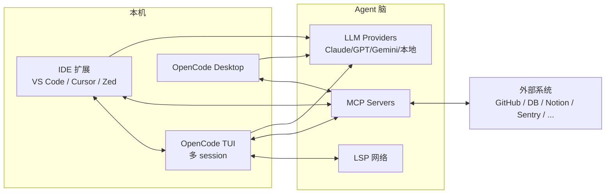
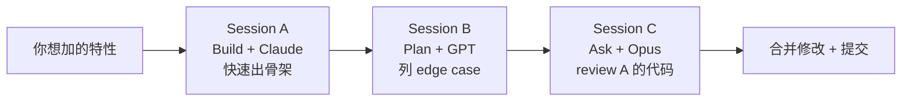
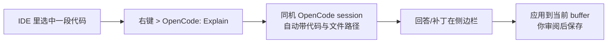
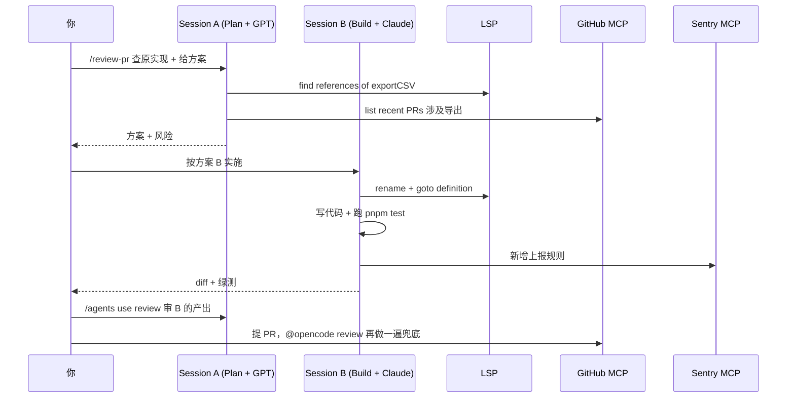

# 进阶：多 session、LSP、MCP 与 IDE / 桌面扩展

## 前言

**C：** 前三篇把 OpenCode 的"单机 + 单 session + 本项目"路子走完了，这一篇讲**怎么让它扩张开**：并行开多个 session、让 LSP 替它兜底、通过 MCP 接外部系统、再把 TUI 之外的 IDE / 桌面版接进工作流。把这四件事串起来，OpenCode 就从"一个终端小工具"长成"一整条开发侧 AI 工作流"了。

<!-- more -->

## 一、全景：从一个 session 到一整条流水线



四个扩张方向：

1. **多 session**：横向并行，一个项目里同时跑多条思路。
2. **LSP**：纵向加厚 Agent 的代码理解力。
3. **MCP**：往外接业务系统，让 Agent 不只改代码。
4. **IDE / 桌面扩展**：把 OpenCode 塞进你原来的工作方式里。

## 二、多 session：同一个项目里开几条线

### 2.1 为什么要开多条？

`vibe-coding/index` 提过"**做得快 vs 做得对**"是两件事。多 session 让你把这两件事分两条线跑：

- **Session A**：小步快跑，拿"**想看什么长什么样**"的原型；
- **Session B**：在同一个仓库上**并行**用更严谨的模型跑单测 / 重构；
- **Session C**：专门开来"跟自己吵架"（review A 的产出）。

### 2.2 怎么开

TUI 里：

```text
> /session new
```

每个 session 是**独立上下文 + 独立模型 + 独立 Agent 人格**，可以各自不同。

列 / 切：

```text
> /sessions
  ● 1. prototype-csv-export         (claude-sonnet, Build)
  ○ 2. refactor-order-service       (gpt-5, Plan)
  ○ 3. review-buddy                 (claude-opus, Ask)
> /session use 2
```

退出 TUI 再回来时，session 不会丢；`/sessions` 里还能看到历史，想继续直接 `use`。

### 2.3 典型模式



几个好用的组合：

- **不同模型交叉审阅**：A 写 B 审，避免单一模型盲区；
- **Plan / Build 分开**：规划的 session 不会被大量工具调用污染；
- **长跑 + 短跑**：A 一直跑大 refactor，B 顺手处理临时小 bug，互不打断。

### 2.4 别忘了 `/compact` 和 `/share`

- 上下文快满时 `/compact`，它会总结早期对话并裁剪，保留结论；
- 要给 reviewer 演示一条会话时 `/share`，生成可访问链接（可加过期）。

## 三、LSP：让 Agent 有"IDE 级别的代码理解"

OpenCode 一个被低估的卖点是**LSP 作为 Agent 的一等工具**。

### 3.1 它自动做了什么

项目打开时 OpenCode 会识别语言，启动相应 LSP（`tsserver`、`rust-analyzer`、`pyright`、`gopls`、`clangd`…）。Agent 会在后台用到：

| 能力 | 含义 |
| -- | -- |
| **goto definition** | 改某函数前先跳到源头看签名 |
| **find references** | 改前找所有调用点，减少破坏性改动 |
| **diagnostics** | 写完代码后读编译/类型报错再修 |
| **hover / signature** | 拿精确参数类型而不是从文件名乱猜 |
| **rename** | 跨文件重命名时先用 LSP 重命名再做其他改动 |

效果：**跨文件 refactor 的幻觉率显著降低**，尤其 TypeScript / Rust / Kotlin 这种强类型项目。

### 3.2 手工配置（可选）

一般不用你管；如果你有**自研语言**或**私有 LSP**，在 `.opencode/config.json` 里加：

```json
{
  "lsp": {
    "my-lang": {
      "command": ["my-lang-server", "--stdio"],
      "extensions": [".mylang"]
    }
  }
}
```

重启 TUI，新扩展名自动走 LSP。

### 3.3 debug：LSP 没起来怎么办

- TUI 里 `/lsp status` 看有没有启动、状态码。
- 常见：没装 `tsserver` → 装个 TypeScript；没装 `rust-analyzer` → `rustup component add rust-analyzer`。
- `/lsp restart <name>` 可单独重启。

## 四、MCP：让 OpenCode 伸手够到业务系统

OpenCode 完整支持 Model Context Protocol（MCP），这是跟 Claude Code / Cursor / ChatGPT Desktop 都通的协议。前面 Hermes / OpenClaw 几册里已经反复用过——这里只讲**OpenCode 里怎么配**。

### 4.1 两种接入

编辑 `.opencode/config.json`（项目级，进 git）或 `~/.config/opencode/config.json`（个人全局）：

```json
{
  "mcp": {
    "servers": {
      "github": {
        "command": "npx",
        "args": ["-y", "@modelcontextprotocol/server-github"],
        "env": {
          "GITHUB_PERSONAL_ACCESS_TOKEN": "${env:GH_TOKEN}"
        }
      },
      "postgres": {
        "command": "uvx",
        "args": ["mcp-server-postgres"],
        "env": {
          "DATABASE_URL": "${env:READONLY_DB_URL}"
        }
      },
      "sentry": {
        "url": "https://sentry.example.com/mcp",
        "headers": { "Authorization": "Bearer ${env:SENTRY_TOKEN}" }
      }
    }
  }
}
```

第一种是**子进程 MCP**（npx / uvx 常见），第二种是**HTTP MCP**（远端服务）。

### 4.2 验证

TUI 里：

```text
> /mcp list
  github   ● running    12 tools
  postgres ● running     4 tools
  sentry   ● running     6 tools

> /mcp tools github
  create_issue, list_pulls, get_pr, review_pr, ...
```

直接问："**看下 sst/opencode 里最近 5 个 open 的 PR，哪些改到了 providers/**" ——它会自己挑 GitHub MCP 工具组合调用。

### 4.3 权限：不要放任

MCP 工具一旦放行等于给了 Agent 外部账号权限。**务必遵守**：

- 能只读的全上只读（如 Postgres 用 READONLY 连接串）；
- 写类 MCP 工具（GitHub create/update、Jira create issue）**保持 Ask 档**；
- 敏感 token 放环境变量 / keychain，**不要明文写 config**；
- 生产域的 MCP（线上 DB / 发版系统）默认**不装**，临时需要时手工装、用完卸。

::: warning 生产 MCP ≠ 开发 MCP
"读生产日志"和"写生产库"是两种东西。建议生产相关的 MCP 单独放 `~/.config/opencode/config.prod.json`，且只在**专门的 session** 里 `/mcp load prod`，用完立刻 `/mcp unload prod`。
:::

## 五、IDE 扩展 & 桌面版：TUI 之外的入口

OpenCode 的本体是 TUI，但官方提供了几种额外入口：

### 5.1 Desktop App（Beta）

```bash
brew install --cask opencode-desktop
```

特点：

- 用 GUI 管理凭据 / MCP / sessions；
- 多 session 以**标签页**形式展示；
- 有面板视图看 diff / 工具调用日志，适合**非终端重度用户**。

### 5.2 IDE 扩展

支持的编辑器（都在 Marketplace 上）：**VS Code、Cursor、Zed、Windsurf、VSCodium**。

装完后你会看到两件事：

- 侧边栏有个 OpenCode 面板，直接嵌 TUI；
- 编辑器右键 / 命令面板能把"**当前选中代码**"或"**当前 diff**"塞进对话。

对应的**工作流**：



和 CLI TUI 共用一套 session / 配置，**你在 CLI 里的 AGENTS.md、MCP、Slash 全都能用**。

### 5.3 GitHub / GitLab 集成

在 repo 的 settings 里装 OpenCode App（或 GitLab 的 Access Token），之后：

- 在 PR 评论里 `@opencode review`：生成 review 评论；
- 在 issue 下 `@opencode plan`：生成实现方案；
- 可配合自己的 `.opencode/` 规则跑——相当于 **MR/PR pipeline 里的轻量 AI reviewer**。

::: tip 边界
云端 OpenCode App 跑在 SST 侧（或自己 self-host）。**不要让它接触你本机的敏感 MCP**，云 / 本地两套 config 要分开。
:::

## 六、把四件事串起来：一个真实场景

你拿到任务"把 `legacy-csv-export` 重构成新架构，加错误上报"。一个合理的 OpenCode 使用方式：



**每一处扩张都在岗**：

- 多 session 让规划 / 实施 / 审阅不互相污染；
- LSP 让跨文件 refactor 稳；
- MCP 把 GitHub / Sentry 变成 Agent 的手脚；
- IDE 扩展让你在写代码的**同一个窗口**完成所有交互；
- GitHub 集成在云端再兜底一次。

## 七、小结

- **多 session**：同项目并行多思路，`/session new`、`/sessions` 管理，善用 `/compact`、`/share`。
- **LSP**：OpenCode 最独特的能力之一，让 Agent 的代码理解接近 IDE 水平；必要时在 `config.json` 里扩自研 LSP。
- **MCP**：把业务系统（GitHub / DB / Notion / Sentry）接进来，**开发 / 生产分开**，写操作保持 Ask 档。
- **IDE / 桌面 / GitHub 集成**：四个入口共用同一套配置，选你顺手的进入方式即可。

把这些用起来之后，OpenCode 就不是"一个 Claude Code 替代"——而是团队里**所有人**、**所有项目**都能复用的 AI 开发层。

::: tip 延伸阅读

- [OpenCode MCP 配置](https://opencode.ai/docs/mcp)
- [OpenCode IDE 扩展](https://opencode.ai/docs/ide)
- [Model Context Protocol 官方](https://modelcontextprotocol.io)
- 本章回顾：01 定位 → 02 安装 → 03 项目侧 → 04 进阶

:::
